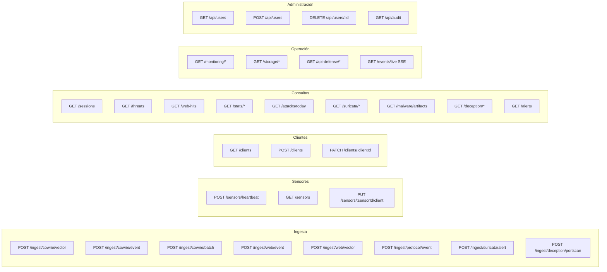

import { Aside } from '@astrojs/starlight/components';

La ingest-api escucha en el puerto `3000`. En produccion solo es accesible desde la red interna Docker o via VPN — no esta expuesta a internet.

<Aside>
Los endpoints `POST /ingest/*` y `POST /sensors/*` requieren el header `X-Ingest-Token: <INGEST_SHARED_SECRET>` si la variable esta definida. Los endpoints `GET` no requieren autenticacion.
</Aside>

---

## Mapa de endpoints



<Aside type="note">
Los endpoints del bloque **Administracion** (`/api/users`, `/api/audit`) son rutas del Dashboard (Next.js, puerto 4000) — no del ingest-api (puerto 3000). Requieren una cookie de sesion activa de better-auth en lugar del header `X-Ingest-Token`.
</Aside>

---

## Health

### `GET /health`

Estado de la API y timestamp del ultimo evento recibido.

**Respuesta:**
```json
{
  "status": "ok",
  "timestamp": "2024-01-15T10:30:00.000Z",
  "lastEvent": "2024-01-15T10:29:55.000Z"
}
```

---

## Ingesta SSH (Cowrie)

### `POST /ingest/cowrie/vector`

Endpoint principal de ingesta SSH. Usado por **Vector** (log shipper). Acepta un array JSON de eventos Cowrie en formato nativo — el mismo que escribe Cowrie en `cowrie.json`.

**Headers:** `X-Ingest-Token: <secret>`, `Content-Type: application/json`

**Body:** array de 1 a 1000 eventos Cowrie.

```json
[
  {
    "eventid": "cowrie.session.connect",
    "src_ip": "1.2.3.4",
    "src_port": 54321,
    "session": "abc123",
    "timestamp": "2024-01-15T10:30:00.000Z"
  },
  {
    "eventid": "cowrie.login.failed",
    "username": "admin",
    "password": "123456",
    "session": "abc123",
    "timestamp": "2024-01-15T10:30:01.000Z"
  }
]
```

**Respuesta:**
```json
{
  "total": 2,
  "inserted": 2,
  "duplicates": 0,
  "sessionsCreated": 1,
  "errors": 0
}
```

---

### `POST /ingest/cowrie/event`

Ingesta un evento Cowrie individual.

**Headers:** `X-Ingest-Token: <secret>`

**Body:** objeto JSON con un evento Cowrie.

---

### `POST /ingest/cowrie/batch`

Ingesta un array de eventos Cowrie. Mismo formato que `/ingest/cowrie/vector`.

**Headers:** `X-Ingest-Token: <secret>`

**Body:**
```json
[
  { "eventid": "cowrie.session.connect", "src_ip": "1.2.3.4", ... },
  { "eventid": "cowrie.login.failed", "username": "admin", ... }
]
```

---

### `POST /ingest/cowrie/file`

Sube un archivo `cowrie.json` completo (una linea JSON por evento).

**Headers:** `X-Ingest-Token: <secret>`, `Content-Type: multipart/form-data`

---

## Ingesta Web

### `POST /ingest/web/vector`

Ingesta batch de hits HTTP enviados por **Vector** (galah.toml). Acepta el mismo schema que `/ingest/web/event` pero en array, procesado tras la transformacion de Vector.

**Headers:** `X-Ingest-Token: <secret>`, `Content-Type: application/json`

---

### `POST /ingest/web/event`

Ingesta un hit HTTP del web honeypot.

**Headers:** `X-Ingest-Token: <secret>`

**Body:**
```json
{
  "eventId": "0d04c3f9-7303-4f8b-b0f1-55817d58cbd7",
  "sensorId": "web-prod-01",
  "srcIp": "1.2.3.4",
  "method": "GET",
  "path": "/wp-login.php",
  "query": "",
  "userAgent": "sqlmap/1.7",
  "headers": {},
  "body": "",
  "attackType": "scanner",
  "timestamp": "2024-01-15T10:30:00.000Z"
}
```

---

## Ingesta de protocolos de red

### `POST /ingest/protocol/event`

Ingesta un evento de protocolo de red (FTP, MySQL, SMB, port scan, etc.). Usado por ftp-honeypot, mysql-honeypot, port-honeypot y el shipper de Dionaea.

**Headers:** `X-Ingest-Token: <secret>`

**Body:**
```json
{
  "sensorId": "dionaea-sensor-01",
  "protocol": "smb",
  "srcIp": "1.2.3.4",
  "srcPort": 54321,
  "dstPort": 445,
  "eventType": "connect",
  "timestamp": "2024-01-15T10:30:00.000Z",
  "data": {}
}
```

---

## Ingesta Suricata (IDS)

### `POST /ingest/suricata/alert`

Ingesta alertas de Suricata en formato EVE JSON. Acepta un objeto único o un array (batch). Las alertas internas de ruido (`SURICATA STREAM`, `SURICATA FLOW`) se descartan y las IPs propias (`SURICATA_OWN_IPS`) se filtran.

**Headers:** `X-Ingest-Token: <secret>`

**Body:**
```json
{
  "sensorId": "suricata-edge-01",
  "timestamp": "2024-01-15T10:30:00.000Z",
  "src_ip": "1.2.3.4",
  "src_port": 54321,
  "dest_ip": "10.0.0.5",
  "dest_port": 22,
  "proto": "TCP",
  "alert": {
    "signature_id": 2001978,
    "signature": "ET SCAN Potential SSH Scan",
    "category": "Attempted Information Leak",
    "severity": 2,
    "action": "allowed"
  }
}
```

Ver [Suricata (IDS)](/intelligence/suricata/).

---

## Ingesta red de engaño

### `POST /ingest/deception/portscan`

Ingesta un evento de port scan detectado por un nodo OpenCanary de la red interna de engaño.

**Headers:** `X-Ingest-Token: <secret>`

**Body:**
```json
{
  "id": "ps_abc123",
  "sensorId": "fake-db",
  "srcIp": "10.0.1.100",
  "dstPorts": [22, 3306, 445],
  "nodeId": "fake-db",
  "scanType": "tcp",
  "timestamp": "2024-01-15T10:30:00.000Z"
}
```

Los nodos de engaño también reportan interacciones completas vía `POST /ingest/protocol/event` con `data.source = "opencanary"`. Ver [Red de engaño](/intelligence/deception/).

---

## Sensores

### `POST /sensors/heartbeat`

Registra o actualiza un sensor. Llamado por `heartbeat.py` cada 30 segundos desde cada sensor activo.

**Headers:** `X-Ingest-Token: <secret>`

**Body:**
```json
{
  "sensorId": "cowrie-ssh-prod-01",
  "name": "SSH Honeypot (Cowrie) - VPS Berlin",
  "protocol": "ssh",
  "clientSlug": "cliente-a",
  "clientName": "Cliente A",
  "ip": "1.2.3.4",
  "version": "cowrie",
  "ports": [22],
  "probePorts": [22],
  "host": "cowrie"
}
```

**Respuesta:**
```json
{ "ok": true }
```

---

### `GET /sensors`

Lista todos los sensores registrados con su estado online/offline y contador de eventos.

**Respuesta:**
```json
[
  {
    "sensorId": "cowrie-ssh-prod-01",
    "clientId": "cl_123",
    "clientName": "Cliente A",
    "clientSlug": "cliente-a",
    "name": "SSH Honeypot (Cowrie) - VPS Berlin",
    "protocol": "ssh",
    "ip": "1.2.3.4",
    "version": "cowrie",
    "ports": [22],
    "probeHost": "cowrie",
    "online": true,
    "lastSeen": "2024-01-15T10:29:45.000Z",
    "createdAt": "2024-01-15T08:00:00.000Z",
    "eventsTotal": 1543,
    "portStatus": {
      "22": true
    }
  }
]
```

---

### `PUT /sensors/:sensorId/client`

Asigna o desasigna un sensor manualmente desde la vista de cliente.

**Headers:** `X-Ingest-Token: <secret>`

Asignar:

```json
{
  "clientId": "cl_123"
}
```

Desasignar:

```json
{
  "clientId": null
}
```

**Respuesta:**

```json
{
  "sensorId": "cowrie-ssh-prod-01",
  "clientId": "cl_123",
  "clientName": "Cliente A",
  "clientSlug": "cliente-a"
}
```

---

## Clientes

### `GET /clients`

Lista todos los clientes registrados.

**Respuesta:**

```json
[
  {
    "id": "cl_123",
    "name": "Cliente A",
    "slug": "cliente-a",
    "description": "SOC retail Ecuador",
    "forwardUrl": "https://ingestapi.com/alerts/cop-pz",
    "createdAt": "2026-05-10T15:00:00.000Z"
  }
]
```

---

### `POST /clients`

Crea un cliente o actualiza uno existente si el `slug` ya existe.

**Headers:** `X-Ingest-Token: <secret>`

**Body:**

```json
{
  "name": "Cliente A",
  "slug": "cliente-a",
  "description": "SOC retail Ecuador",
  "forwardUrl": "https://ingestapi.com/alerts/cop-pz"
}
```

`forwardUrl` es opcional, pero si se define debe empezar con `http://` o `https://`.

---

### `PATCH /clients/:clientId`

Actualiza `name`, `description` o `forwardUrl`.

**Headers:** `X-Ingest-Token: <secret>`

**Body:**

```json
{
  "forwardUrl": "https://ingestapi.com/alerts/cop-pz"
}
```

Si `forwardUrl` llega vacio, el forwarding para ese cliente queda deshabilitado.

---

## Sesiones SSH

### `GET /sessions`

Lista paginada de sesiones SSH.

**Query params:**

| Param | Tipo | Default | Descripcion |
|-------|------|---------|-------------|
| `page` | number | 1 | Numero de pagina |
| `limit` | number | 20 | Resultados por pagina (max 100) |
| `loginSuccess` | boolean | — | Filtrar por login exitoso |
| `ip` | string | — | Filtrar por IP de origen |

**Respuesta:**
```json
{
  "data": [...],
  "meta": { "page": 1, "limit": 20, "total": 1543, "totalPages": 78 }
}
```

---

### `GET /sessions/:id`

Detalle de una sesion con todos sus eventos ordenados por timestamp.

---

### `GET /sessions/scan-groups`

Sesiones agrupadas por campana de ataque (misma IP, patron de comandos similares).

**Query params:** `page`, `limit`

---

## Eventos

### `GET /events`

Lista paginada de eventos SSH individuales.

**Query params:** `page`, `limit`, `sessionId`, `eventType`

---

## Web Hits

### `GET /web-hits`

Lista paginada de hits HTTP al honeypot web.

**Query params:** `page`, `limit`, `ip`, `attackType`, `path`

---

### `GET /web-hits/stats`

Total de hits, distribucion por tipo de ataque y top IPs atacantes.

---

### `GET /web-hits/timeline`

Hits agrupados por dia y tipo de ataque (ultimos 30 dias).

---

### `GET /web-hits/paths`

Top 50 paths mas atacados con conteo y tipos detectados.

---

### `GET /web-hits/by-ip`

Hits agrupados por IP atacante con totales y tipos de ataque. Soporta paginacion.

**Query params:** `page`, `limit`

---

## Threat Intelligence

### `GET /threats`

Todas las IPs con risk score, ordenadas por score DESC.

**Query params:** `q` (busca por IP), `levels` (CSV: `CRITICAL,HIGH,...`), `commands` (filtra por categoría de comando), `crossProtocol` (boolean), `clientSlug` / `sensorId` (scope multi-tenant), `page`, `limit`.

**Respuesta:**
```json
[
  {
    "ip": "1.2.3.4",
    "score": 87,
    "level": "CRITICAL",
    "protocols": ["ssh", "http"],
    "topFactors": ["malware_drop", "persistence"]
  }
]
```

---

### `GET /threats/:ip`

Detalle completo de una IP:

- Score breakdown por categoria (SSH, web, comandos, cross-protocol)
- Clasificacion de comandos por tipo (recon, persistence, malware, etc.)
- Timeline de actividad SSH y web
- Historial de web hits

---

## Estadisticas y Dashboard

### `GET /stats/overview`

Timeline de sesiones SSH y web hits por dia. Usado por la grafica principal del overview.

**Query params:** `from` (ISO date), `to` (ISO date)

---

### `GET /stats/dashboards`

Metricas agregadas para el dashboard: totales, funnel de autenticacion, top IPs, top paises, top comandos y distribucion de tipos de sesion.

---

### `GET /stats/credentials`

Credenciales mas usadas: top usernames, top passwords y top pares username+password.

**Query params:** `limit` (default: 20)

---

### `GET /stats/geo`

Conteo de sesiones y eventos por pais de origen (basado en geolocalizacion de IP).

---

### `GET /stats/heatmap`

Conteo de ataques por dia de semana y hora del dia — matriz 7x24 para el heatmap del dashboard.

---

### `GET /stats/session-commands`

Comandos ejecutados en sesiones SSH, agrupados por tipo y frecuencia.

---

## Ataques del dia

### `GET /attacks/today`

Total de ataques (sesiones SSH + web hits + protocol hits) en las ultimas 24 horas.

**Respuesta:**
```json
{
  "total": 342,
  "ssh": 120,
  "web": 198,
  "protocol": 24,
  "from": "2024-01-14T10:30:00.000Z",
  "to": "2024-01-15T10:30:00.000Z"
}
```

---

## Alertas

### `GET /alerts`

Alertas recientes generadas por el motor de amenazas (IP que cruza umbral CRITICAL/HIGH, breach de un nodo de engaño, sensor offline, etc.). Incluye el conteo de no leídas.

**Query params:** `limit` (default 50, máx 200), `unreadOnly` (boolean), `clientId` (scope multi-tenant).

**Respuesta:**
```json
{
  "alerts": [
    {
      "id": "al_123",
      "alertKey": "threat:1.2.3.4",
      "level": "critical",
      "title": "IP crítica detectada",
      "description": "...",
      "fields": {},
      "srcIp": "1.2.3.4",
      "sensorId": "cowrie-ssh-prod-01",
      "clientId": "cl_123",
      "clientName": "Cliente A",
      "readAt": null,
      "createdAt": "2024-01-15T10:30:00.000Z"
    }
  ],
  "unreadCount": 3
}
```

### `POST /alerts/:id/read`
Marca una alerta como leída.

### `POST /alerts/read-all`
Marca como leídas todas las alertas no leídas (scopeado al `clientId` si se pasa).

### `DELETE /alerts/:id`
Borra una alerta. Un id no cruza tenants.

### `DELETE /alerts`
Borra todas las alertas (scopeado al `clientId` si se pasa).

Ver [Alertas de Discord](/services/discord-alerts/) y [Multi-tenant](/services/multi-tenant/).

---

## Suricata (IDS)

### `GET /suricata/alerts`

Alertas IDS paginadas.

**Query params:** `page`, `pageSize`, `severity`, `srcIp`, `q` (firma/categoría), `hideNoise` (boolean), `excludeOwnIps` (boolean).

### `GET /suricata/stats`

Estadísticas agregadas por rango: totales, conteo por severidad, top firmas, top IPs y timeline.

**Query params:** `range` (`24h` | `7d` | `30d`).

Ver [Suricata (IDS)](/intelligence/suricata/).

---

## Malware / captura de archivos

### `GET /malware/artifacts`

Lista paginada de archivos capturados (binarios de Dionaea, descargas de Cowrie, uploads de FTP).

**Query params:** `page`, `pageSize`, `q` (hash o tipo de archivo), `sortBy` (`capturedAt` | `size` | `fileType`).

### `GET /malware/artifacts/:md5/download`
Descarga el binario capturado.

### `GET /malware/artifacts/:md5/lookup`
Consulta el hash en la API de MalwareBazaar.

Ver [Malware y captura de archivos](/intelligence/malware/).

---

## Red de engaño

### `GET /deception/overview`
Resumen: nodos totales y online, hits 24h/7d, intentos de auth 24h, IPs internas únicas, último evento.

### `GET /deception/nodes`
Array de nodos trampa: `sensorId`, `name`, `ip`, `ports`, `online`, `lastSeen`, `hits`, `authAttempts`.

### `GET /deception/killchain`
Cadenas de ataque correlacionadas (por sesión Cowrie o por IP interna + ventana): IP pública, nodos tocados, duración, pasos.

### `GET /deception/events`
Eventos de interacción con nodos, paginados. **Query params:** `page`, `limit`, `nodeId`.

### `GET /deception/portscans`
Port scans internos paginados. **Query params:** `page`, `limit`, `nodeId`.

<Aside type="note">
Cada endpoint tiene su variante scopeada por cliente en `GET /clients/:clientSlug/deception/*`.
</Aside>

Ver [Red de engaño](/intelligence/deception/).

---

## Monitoreo

### `GET /monitoring/system`
Snapshot actual: CPU load (1m/5m/15m), RAM (usada/total/%), uptime e info de Redis (versión, hits/misses, hit rate, ops/seg, clientes conectados).

### `GET /monitoring/history`
Timeline histórico de CPU y RAM. **Query params:** `range` (`24h` | `7d` | `30d`).

### `GET /monitoring/containers/stats`
Snapshot de CPU/RAM por contenedor.

### `GET /monitoring/containers/history`
Timeline de los 6 contenedores más pesados. **Query params:** `range`.

Ver [Monitoreo](/operations/monitoring/).

---

## Almacenamiento y retención

### `GET /storage/stats`
Uso de disco (total/libre/usado), tamaño de la BD y desglose por tabla.

### `GET /storage/ingestion`
Timeline de bytes ingeridos por fuente (ssh/web/protocol/defense). **Query params:** `range`.

### `GET /storage/retention`
Política de retención por tabla: días, habilitado, antigüedad del registro más viejo, filas pendientes de purgar, última y próxima ejecución.

### `PUT /storage/retention/:id`
Actualiza `retentionDays` o `enabled` de una tabla.

**Headers:** `X-Ingest-Token: <secret>`

Ver [Almacenamiento y retención](/operations/storage/).

---

## Defensa de la API

### `GET /api-defense/events`
Eventos de ataque contra la propia ingest-api, paginados. **Query params:** `page`, `pageSize`, `attackType`, `ip`.

### `GET /api-defense/summary`
Stats de hoy: conteo por tipo (`scanner`, `path_probe`, `injection`, `brute_force`), top IPs, total.

### `GET /api-defense/allowlist` · `POST` · `DELETE /:id`
Gestiona la allowlist de IPs/CIDR confiables.

### `GET /api-defense/blocked` · `POST` · `DELETE /:id`
Gestiona las IPs bloqueadas (manuales o automáticas).

**Headers (POST/DELETE):** `X-Ingest-Token: <secret>`

Ver [Defensa de la API](/operations/api-defense/).

---

## Ataques en vivo (SSE)

### `GET /events/live`

Stream **Server-Sent Events** (`text/event-stream`) que emite cada ataque conforme se ingiere. Lo consume el mapa de ataques en vivo del dashboard. Envía un heartbeat periódico para mantener la conexión.

**Formato de cada evento:**
```json
{
  "type": "ssh",
  "ip": "1.2.3.4",
  "country": "US",
  "lat": 40.71,
  "lon": -74.0,
  "dstPort": 22,
  "timestamp": "2024-01-15T10:30:00.000Z"
}
```

---

## API del Dashboard (administracion)

<Aside>
Estos endpoints son rutas **Next.js** en el Dashboard (puerto 4000). Requieren una cookie de sesion `better-auth.session_token` valida — no usan `X-Ingest-Token`.
</Aside>

### `GET /api/users`

Lista todos los usuarios registrados en la plataforma.

**Respuesta:**
```json
[
  {
    "id": "usr_abc123",
    "name": "Nicolas Moina",
    "email": "nicolas@empresa.com",
    "emailVerified": false,
    "createdAt": "2026-05-17T10:00:00.000Z",
    "updatedAt": "2026-05-17T10:00:00.000Z"
  }
]
```

---

### `POST /api/users`

Crea un nuevo usuario. Solo accesible para usuarios autenticados.

**Body:**
```json
{
  "name": "Ana Lopez",
  "email": "ana@empresa.com",
  "password": "contraseña-segura"
}
```

**Respuesta (`201`):**
```json
{
  "id": "usr_def456",
  "name": "Ana Lopez",
  "email": "ana@empresa.com"
}
```

| Codigo | Descripcion |
|--------|-------------|
| `201` | Usuario creado |
| `400` | Faltan campos o la contrasena tiene menos de 8 caracteres |
| `401` | Sin sesion activa |
| `409` | Email ya registrado |

---

### `DELETE /api/users/:id`

Elimina un usuario y todas sus sesiones activas. No se puede eliminar el propio usuario en sesion.

**Respuesta exitosa:** `204 No Content`

| Codigo | Descripcion |
|--------|-------------|
| `204` | Usuario eliminado |
| `400` | Intentando eliminar la propia cuenta |
| `401` | Sin sesion activa |
| `404` | Usuario no encontrado |

---

### `PATCH /api/users/:id`

Actualiza el nombre de un usuario.

**Body:**
```json
{ "name": "Nuevo Nombre" }
```

**Respuesta (`200`):**
```json
{
  "id": "usr_def456",
  "name": "Nuevo Nombre",
  "email": "ana@empresa.com"
}
```

---

### `GET /api/audit`

Lista paginada del audit log con filtros opcionales.

**Query params:**

| Param | Tipo | Default | Descripcion |
|-------|------|---------|-------------|
| `page` | number | 1 | Pagina |
| `limit` | number | 50 | Resultados por pagina (max 100) |
| `action` | string | — | Filtrar por accion (`CREATE`, `UPDATE`, `DELETE`, `DOWNLOAD`, `LOGIN`, `LOGOUT`) |
| `resource` | string | — | Filtrar por recurso (`USER`, `CLIENT`, `SENSOR`, `TOKEN`, `MALWARE`, `SETTINGS`, `SESSION`) |
| `userId` | string | — | Filtrar por usuario especifico |

**Respuesta:**
```json
{
  "entries": [
    {
      "id": "a1b2c3d4-...",
      "userId": "usr_abc123",
      "userEmail": "nicolas@empresa.com",
      "userName": "Nicolas Moina",
      "action": "DELETE",
      "resource": "SENSOR",
      "resourceId": "cowrie-ssh-prod-01",
      "resourceName": "cowrie-ssh-prod-01",
      "details": {},
      "ipAddress": "192.168.1.10",
      "userAgent": "Mozilla/5.0 ...",
      "createdAt": "2026-05-17T14:23:11.000Z"
    }
  ],
  "total": 1,
  "page": 1,
  "limit": 50,
  "pages": 1
}
```
