## Componentes del sistema

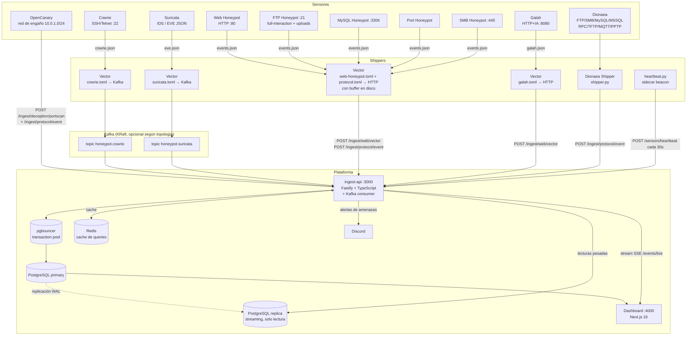

La plataforma es **multi-tenant**: cada sensor pertenece a un cliente y el
aislamiento de datos se aplica en el servidor por `sensor_id`. Ver
[Multi-tenant](/services/multi-tenant/).

### Kafka vs HTTP: qué sensor usa cada canal

Solo **Cowrie** y **Suricata** están migrados a Kafka hoy. Los otros 5
honeypots (web, FTP, MySQL, port, SMB) siguen enviando por HTTP, pero con
**buffer en disco en Vector** — un corte de red o de la API ya no pierde
eventos, quedan en disco y se reenvían al recuperarse. Antes de este cambio
esos 5 sensores hacían POST directo *fire-and-forget* y podían perder eventos
silenciosamente.

| Sensor | Canal | Garantía de entrega |
|--------|-------|----------------------|
| Cowrie | Vector → Kafka (`honeypot.cowrie`) | At-least-once, topic persistente |
| Suricata | Vector → Kafka (`honeypot.suricata`) | At-least-once, topic persistente |
| web-honeypot | Vector → HTTP (buffer en disco) | Reintento automático, sin pérdida |
| FTP / MySQL / Port / SMB | Vector → HTTP (buffer en disco) | Reintento automático, sin pérdida |
| Galah | Vector → HTTP | Reintento automático, sin pérdida |
| Dionaea | shipper.py → HTTP directo | Sin buffer (aún) |
| OpenCanary | POST directo | Sin buffer (aún) |

Migrar los 5 sensores HTTP a Kafka es un TODO explícito ligado a los deploys
multi-host: cambia el `sink` de Vector de `http` a `kafka`, agrega los topics
`honeypot.web` / `honeypot.protocol`, y sus handlers en el consumer — los
sensores en sí **no cambian**, ya escriben a un log de eventos.

---

## Topologias de despliegue

La plataforma soporta cinco configuraciones. Elige segun tu presupuesto y necesidades de aislamiento.

### Desarrollo local (todo en un host)

Un solo `docker compose up` levanta todo junto. El dashboard queda en `http://localhost:4000`.

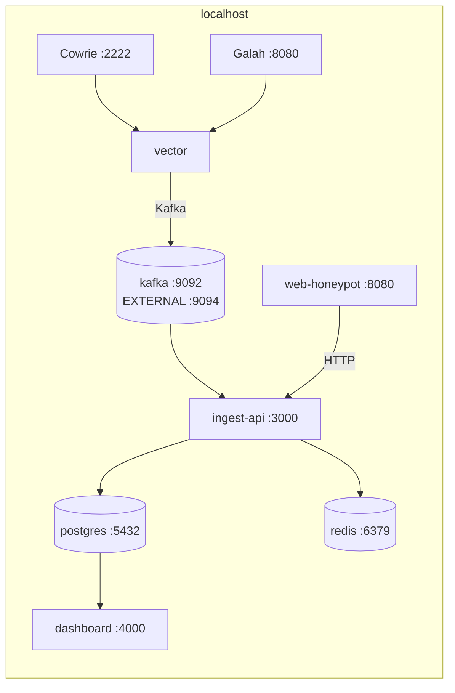

Igual que en produccion, Vector envia Cowrie por Kafka (KRaft, un solo nodo) y el resto de sensores por HTTP directo. La unica diferencia de dev es el listener extra `EXTERNAL://localhost:9094`, pensado para inspeccionar Kafka con herramientas del host (`kafka-console-consumer`, etc.) — no existe en ningun compose de produccion. Un servicio `seed` (no mostrado) corre `prisma db seed` una vez que `ingest-api` esta sano, para poblar datos de ejemplo.

### Lab multi-VM local

Simula la topologia de produccion usando VMs separadas (VirtualBox / VMware). Util para probar la arquitectura distribuida sin un VPS real.

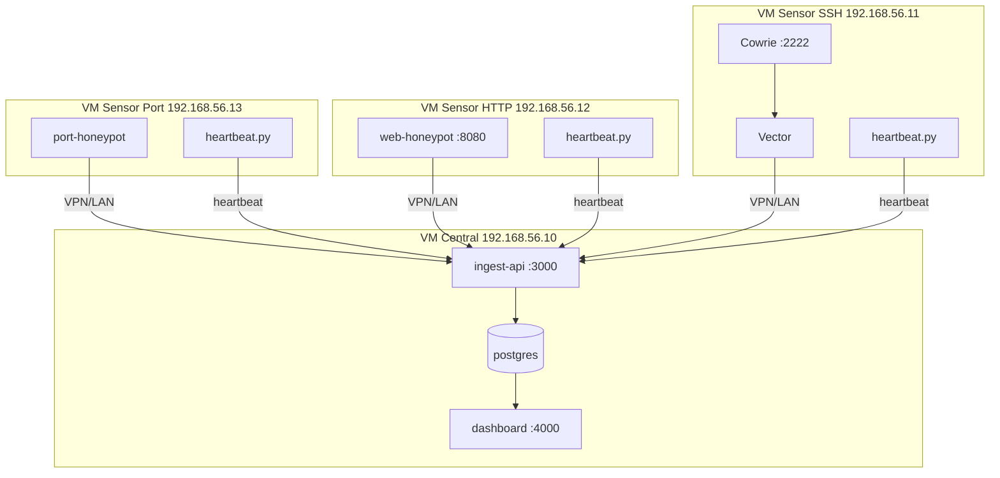

Ver [Multi-VM Local Lab](/deployment/multi-vm-local/).

### Single-host (un VPS)

Todo en el mismo servidor: honeypots, Kafka, Postgres (primary + replica),
pgbouncer, Redis, ingest-api y dashboard. Redes Docker separadas aislan
Cowrie del resto. El dashboard solo es accesible por SSH tunnel — no expuesto
a internet.

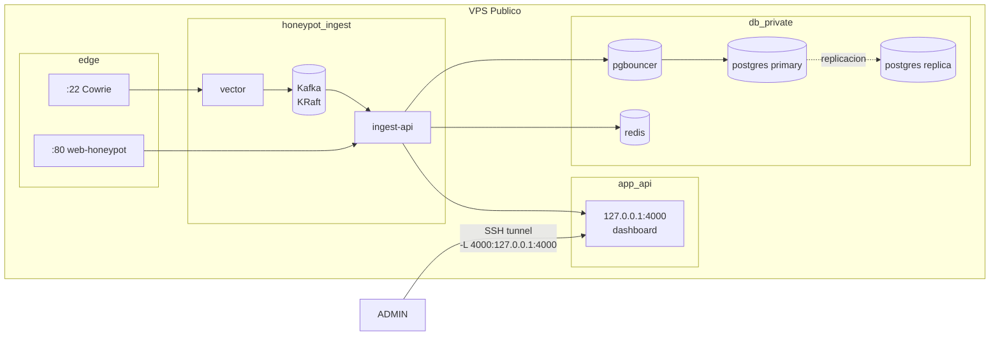

Ver [Single-Host](/deployment/single-host/).

### Two-host con VPN (recomendado para produccion)

Dos servidores conectados por VPN (Tailscale / WireGuard). El dashboard es publicamente accesible via HTTPS (Caddy).

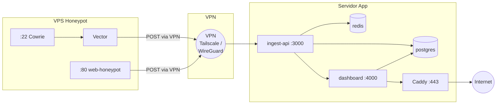

A diferencia de single-host y platform-only, `docker-compose.prod.app.yml` **no incluye Kafka, pgbouncer ni postgres-replica** — es un nivel de base de datos deliberadamente mas simple (Postgres directo, sin pooler ni replica de lectura), acorde a que esta topologia sirve a un unico cliente. `dashboard` tambien mantiene su propia conexion directa a Postgres (`DATABASE_URL`), ademas de consumir `ingest-api`. `redis` si esta presente, con la misma configuracion (`allkeys-lru`) que en las demas topologias.

Ver [Two-Host](/deployment/two-host/).

### Platform-only (servidor central + sensores remotos multi-cliente)

Un servidor central corre **solo la plataforma** (Postgres primary+replica,
pgbouncer, Redis, Kafka, ingest-api, dashboard) y **ningún honeypot**. Los
sensores viven en servidores separados — potencialmente uno por cliente —
cada uno con su propio `docker-compose.prod.honeypot.yml`, y llegan al
servidor central por internet a través de un **Cloudflare Tunnel** que expone
únicamente `ingest-api`, nunca la IP real del servidor.

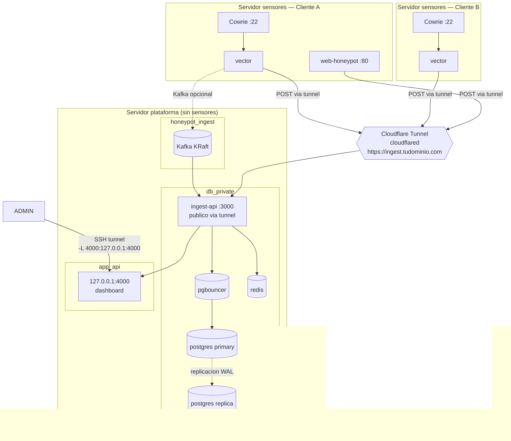

Puntos clave:
- El servidor de plataforma **no tiene IP pública** — solo LAN/Tailscale.
  `cloudflared` corre como servicio systemd en el host (no en un contenedor) y
  expone únicamente `ingest-api:3000`, nunca `postgres` ni el `dashboard`.
- Cada servidor de sensores es independiente y puede pertenecer a un cliente
  distinto (`CLIENT_SLUG`), como en two-host — pero no requiere VPN: solo
  necesita alcanzar el hostname del tunnel por HTTPS.
- `ingest-api` corre con `trustProxy: 'loopback'` para leer la IP real del
  atacante desde `X-Forwarded-For` (sin esto, todo el tráfico tunelado se ve
  como `127.0.0.1`).
- El acceso a Postgres es igual que en single-host: **pgbouncer** en modo
  `transaction` delante del primary, y una **réplica de streaming** para las
  lecturas pesadas del dashboard (agregaciones de `credential_attempts`, etc.).
- Ver [Platform-only](/deployment/platform-only/) para la guía paso a paso,
  incluida la configuración del Cloudflare Tunnel.

---

## Flujo de datos detallado

### Pipeline SSH (Cowrie → Vector → Kafka → ingest-api)

Cowrie y Suricata son los dos sensores migrados a Kafka. Cada evento viaja
como **un mensaje individual** (Vector serializa uno por mensaje); el consumer
de `ingest-api` lo parsea y llama a la misma capa de servicio que usaban los
endpoints HTTP — sin duplicar lógica de risk-score, bot-detector, etc.

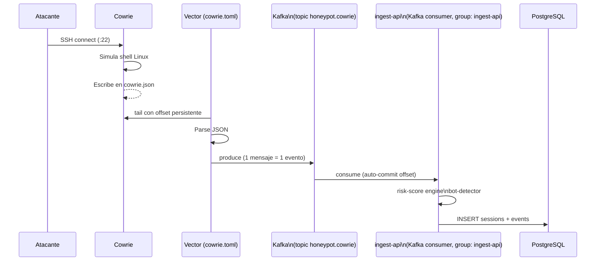

### Pipeline Suricata (IDS → Vector → Kafka → ingest-api)

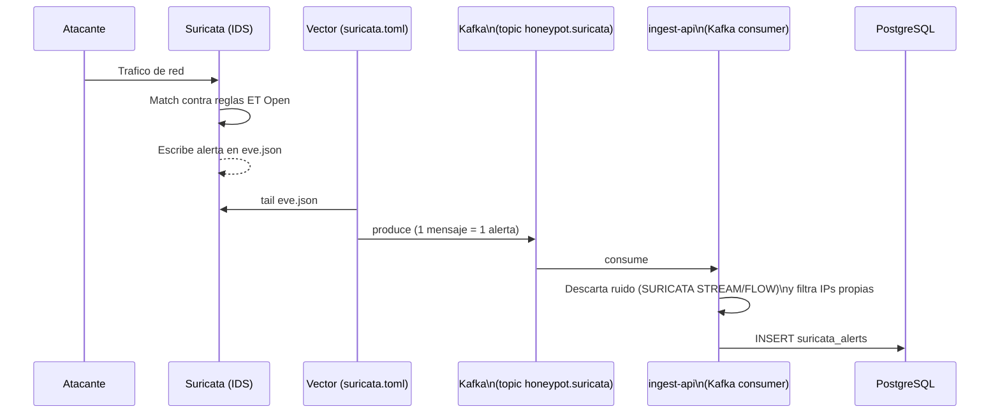

Ver [Suricata (IDS)](/intelligence/suricata/).

### Pipeline HTTP con buffer en disco (web/FTP/MySQL/port/SMB/Galah → ingest-api)

Estos sensores **aún no están en Kafka**. Escriben un log `events.json` que
Vector tailea y entrega por HTTP con **buffer en disco** — si `ingest-api` o
la red fallan, los eventos quedan en disco y se reenvían al recuperarse, en
vez de perderse como con el POST directo *fire-and-forget* anterior.

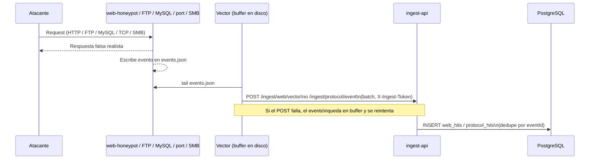

### Pipeline Dionaea → ingest-api

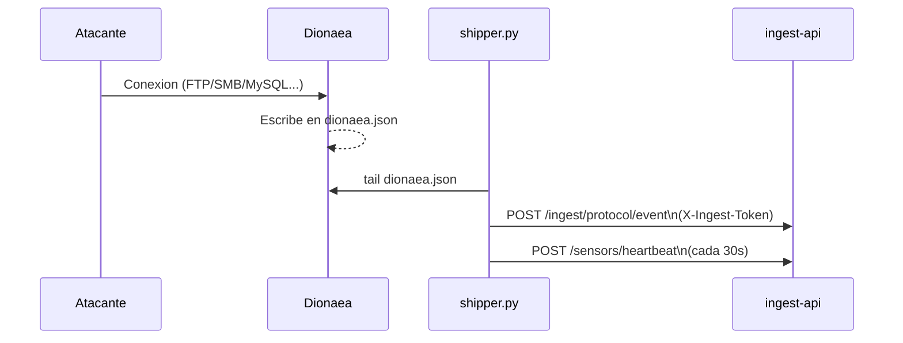

### Sensor health monitoring

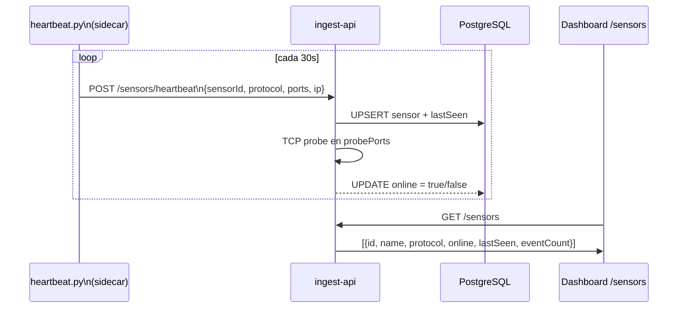

### Pipeline red de engaño (OpenCanary → ingest-api)

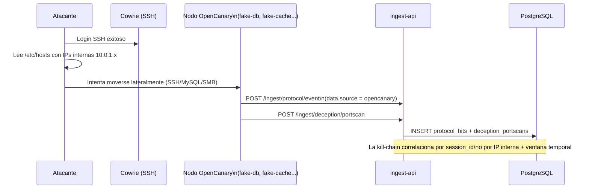

Ver [Red de engaño](/intelligence/deception/).

### Multi-cliente y forwarding

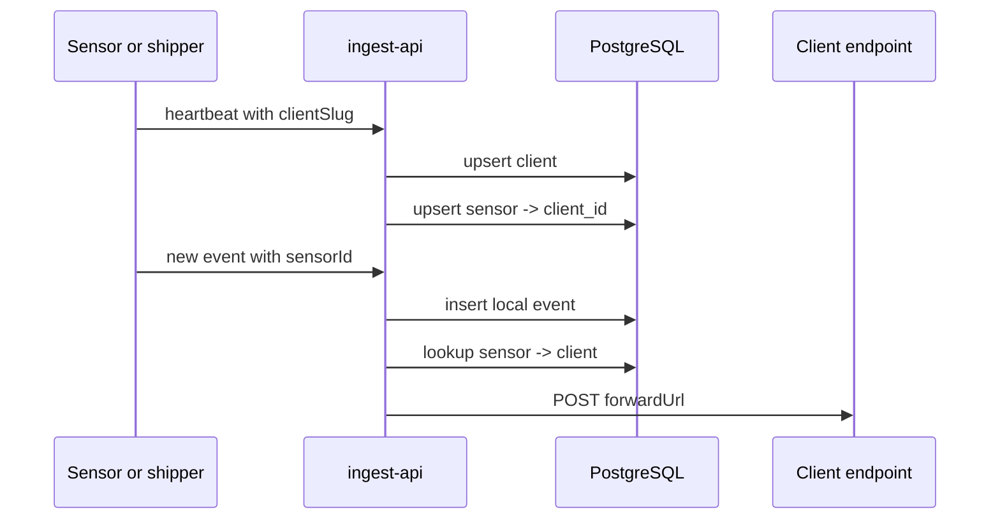

---

## Redes Docker

### Single-host (`docker-compose.prod.single-host.yml`)

El compose real de single-host suma dos redes mas de las que documentabamos
antes: `deception_net` (para los honeypots internos de la red de engaño) y el
trafico de Kafka, que viaja dentro de `honeypot_ingest` junto al resto de la
ingesta.

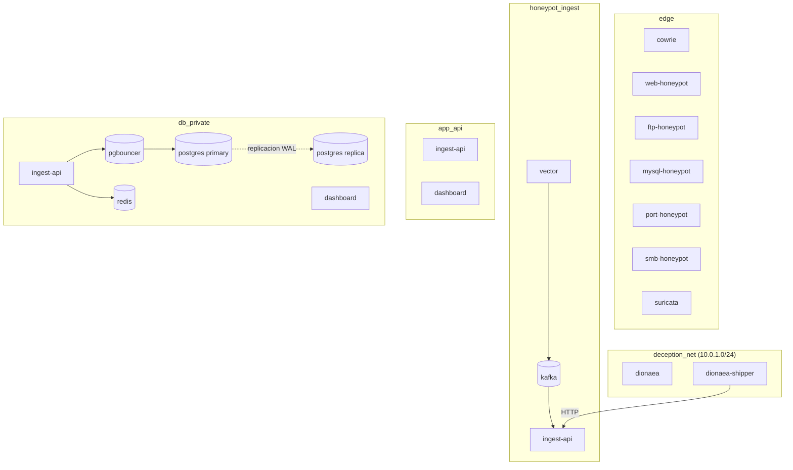

| Red | Servicios | Proposito |
|-----|-----------|-----------|
| `edge` | cowrie, web-honeypot, ftp-honeypot, mysql-honeypot, port-honeypot, smb-honeypot, suricata | Servicios expuestos a internet |
| `deception_net` | dionaea, dionaea-shipper | Red interna aislada para el nodo de deception |
| `honeypot_ingest` | vector, kafka, kafka-init, ingest-api | Pipeline de ingesta (Kafka + HTTP con buffer) |
| `app_api` | ingest-api, dashboard | Comunicacion interna app |
| `db_private` | pgbouncer, postgres, postgres-replica, redis, ingest-api, dashboard | Acceso a base de datos y cache |

**Ningun honeypot tiene ruta directa a `db_private` ni a `app_api`.** Todo pasa por ingest-api.

### Platform-only (`docker-compose.prod.platform.yml`)

El servidor central **no corre ningun honeypot**, asi que no existe la red
`edge`. Las redes internas replican el mismo patron de single-host
(`honeypot_ingest` / `app_api` / `db_private`), pero quien alimenta
`honeypot_ingest` no es un Vector local sino el trafico HTTP que llega desde
los sensores remotos via Cloudflare Tunnel, terminando en `ingest-api:3000`.

| Red | Servicios | Proposito |
|-----|-----------|-----------|
| `honeypot_ingest` | kafka, kafka-init, ingest-api | Kafka queda disponible para topologias mixtas, pero hoy los sensores remotos entran por HTTP, no por Kafka |
| `app_api` | ingest-api, dashboard | Comunicacion interna app |
| `db_private` | pgbouncer, postgres, postgres-replica, redis, ingest-api, dashboard | Acceso a base de datos y cache (auth `scram-sha-256`, distinto del `md5` de single-host) |

### VPS honeypot (`docker-compose.prod.honeypot.yml`)

Una sola red `edge` con todos los servicios de captura (cowrie, web-honeypot,
ftp-honeypot, mysql-honeypot, port-honeypot, smb-honeypot, suricata, vector).
No tiene servicio Kafka local: Vector envia por HTTP hacia `INGEST_API_URL`,
que el operador configura segun la topologia (IP de VPN, hostname de
Cloudflare Tunnel, o `http://ingest-api:3000` si todo corre en el mismo host).

### Servidor app (`docker-compose.prod.app.yml`)

| Red | Servicios | Proposito |
|-----|-----------|-----------|
| `app_api` | ingest-api, dashboard | Comunicacion interna |
| `db_private` | postgres, redis, ingest-api, dashboard | Acceso a base de datos y cache |
| `caddy_net` | caddy, dashboard | Exposicion via HTTPS |

Sin `pgbouncer` ni `postgres-replica` — a diferencia de single-host y platform-only, aqui `ingest-api` y `dashboard` conectan directo a `postgres` (`DATABASE_URL` propia en cada servicio). No hay red `edge`: los honeypots corren en el otro host, via `docker-compose.prod.honeypot.yml`.

---

## Puertos expuestos

| Puerto | Servicio | Descripcion |
|--------|----------|-------------|
| `22` | Cowrie (prod) | SSH honeypot — los atacantes se conectan aqui |
| `80` | Caddy / web-honeypot | HTTP → HTTPS en two-host; honeypot en single-host |
| `443` | Caddy (two-host) | HTTPS dashboard e ingest-api |
| `21` | FTP honeypot | Puerto FTP en produccion |
| `3306` | MySQL honeypot | Puerto MySQL en produccion |
| `445` | SMB honeypot | Puerto SMB en produccion |
| `8022` | sshd admin VPS | Acceso SSH real al servidor |
| `2222` | Cowrie (dev) | SSH honeypot en entorno local |
| `8080` | web-honeypot / Galah (dev) | HTTP honeypot en entorno local |
| `127.0.0.1:4000` | dashboard (single-host / platform-only) | Solo loopback — requiere SSH tunnel |
| `3000` | ingest-api | Red interna en single-host/two-host; **publico** en platform-only, detras de Cloudflare Tunnel (sin puertos inbound abiertos en el firewall) |
| `5432` | PostgreSQL (primary) / postgres-replica | Solo red interna. Nunca publico. |
| `5432` | pgbouncer | Mismo puerto que Postgres, pero en el contenedor `pgbouncer` (`edoburu/pgbouncer`); ingest-api se conecta aqui con `?pgbouncer=true`. Solo red interna. Nunca publico. |
| `9092` / `9093` | Kafka (broker / controller KRaft) | Solo red interna (`honeypot_ingest`). Nunca publico. |
| `6379` | Redis | Solo red interna (`db_private`). Nunca publico. |

---

## Hardening de contenedores

Todos los servicios en produccion aplican:

```yaml
security_opt:
  - no-new-privileges:true
cap_drop:
  - ALL
pids_limit: 256
```

Adicionalmente:
- `web-honeypot` usa `read_only: true` y corre con usuario sin privilegios
- `caddy` solo tiene `NET_BIND_SERVICE`
- `vector` corre con imagen Alpine minimal

---

## Autorizacion entre servicios

Los sensores (web-honeypot, Vector, Dionaea shipper, heartbeat.py) autorizan sus peticiones a ingest-api via el header `X-Ingest-Token`, cuyo valor es `INGEST_SHARED_SECRET`.

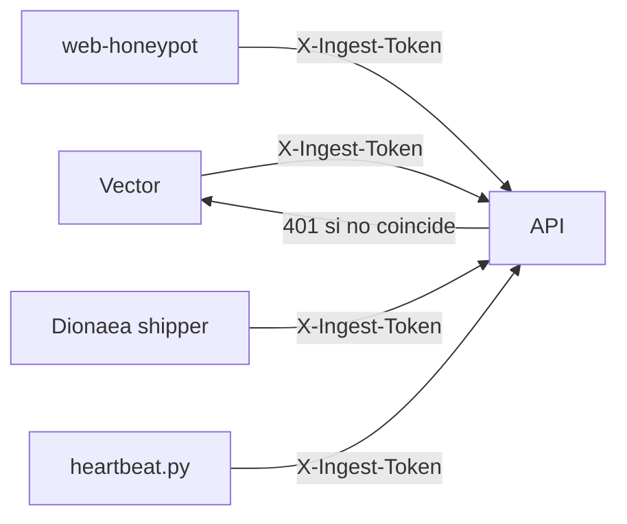

Los endpoints `GET` de ingest-api no requieren autenticacion — estan protegidos por no ser alcanzables desde internet.
