## Componentes del sistema

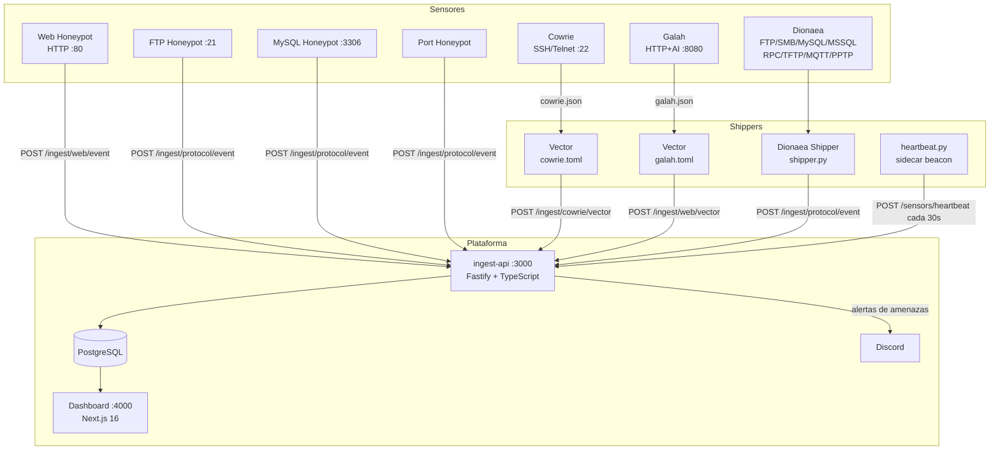

---

## Topologias de despliegue

La plataforma soporta cuatro configuraciones. Elige segun tu presupuesto y necesidades de aislamiento.

### Desarrollo local (todo en un host)

Un solo `docker compose up` levanta todo junto. El dashboard queda en `http://localhost:4000`.

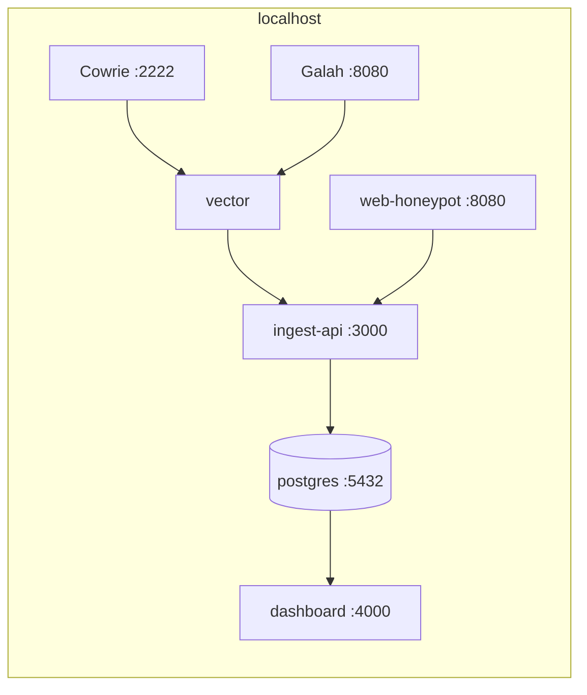

### Lab multi-VM local

Simula la topologia de produccion usando VMs separadas (VirtualBox / VMware). Util para probar la arquitectura distribuida sin un VPS real.

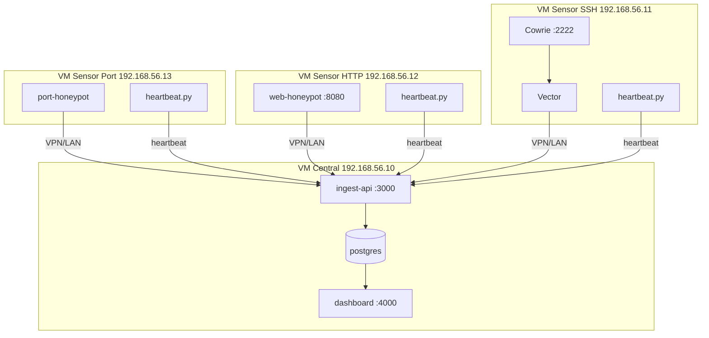

Ver [Multi-VM Local Lab](/deployment/multi-vm-local/).

### Single-host (un VPS)

Todo en el mismo servidor con redes Docker separadas. El dashboard solo es accesible por SSH tunnel — no expuesto a internet.

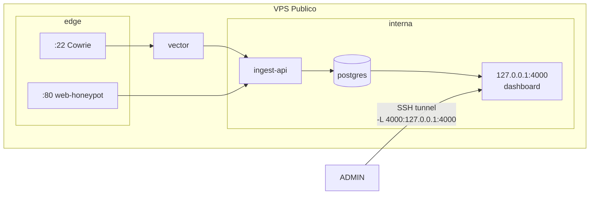

Ver [Single-Host](/deployment/single-host/).

### Two-host con VPN (recomendado para produccion)

Dos servidores conectados por VPN (Tailscale / WireGuard). El dashboard es publicamente accesible via HTTPS (Caddy).

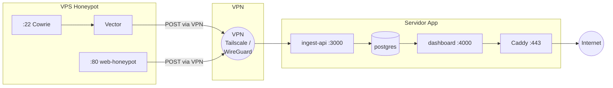

Ver [Two-Host](/deployment/two-host/).

---

## Flujo de datos detallado

### Pipeline SSH (Cowrie → ingest-api)

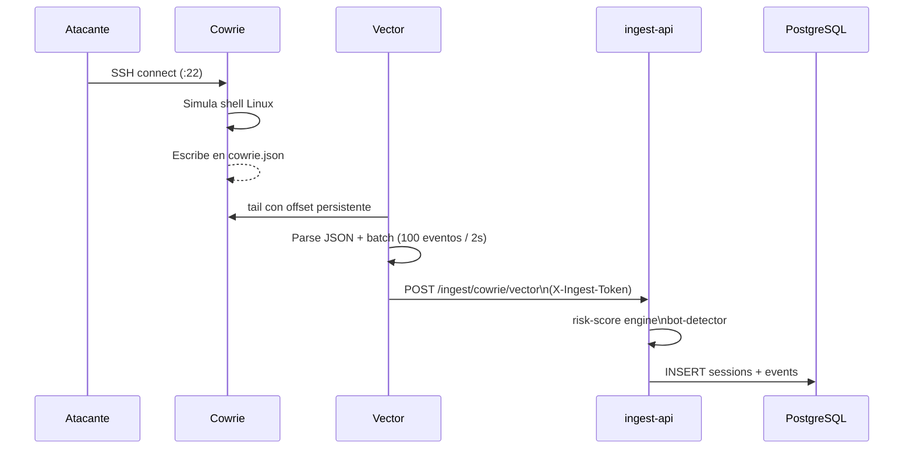

### Pipeline HTTP (web-honeypot / Galah → ingest-api)

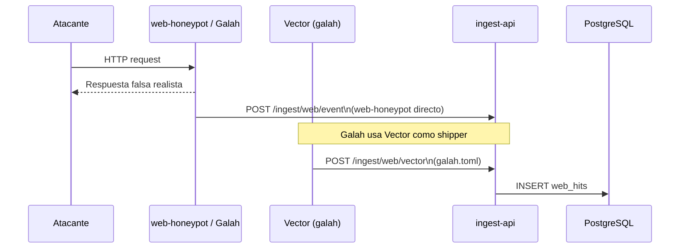

### Pipeline Dionaea → ingest-api

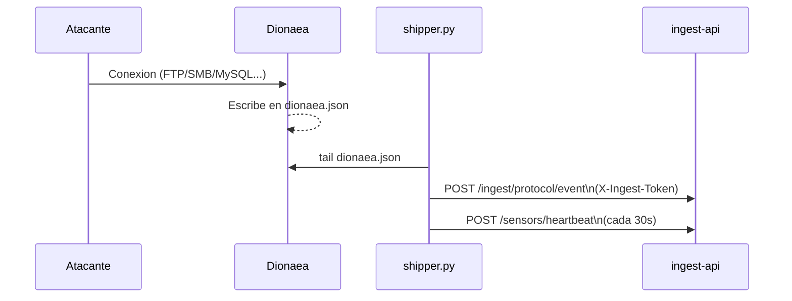

### Sensor health monitoring

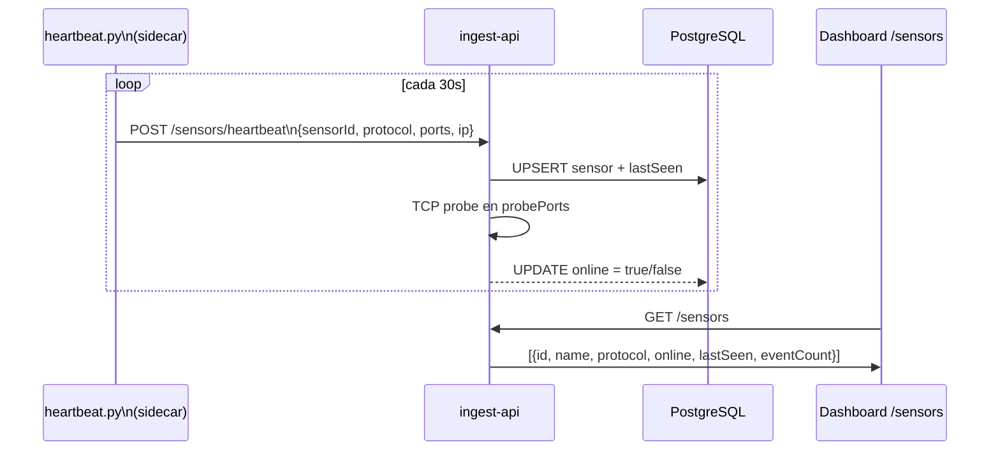

### Multi-cliente y forwarding

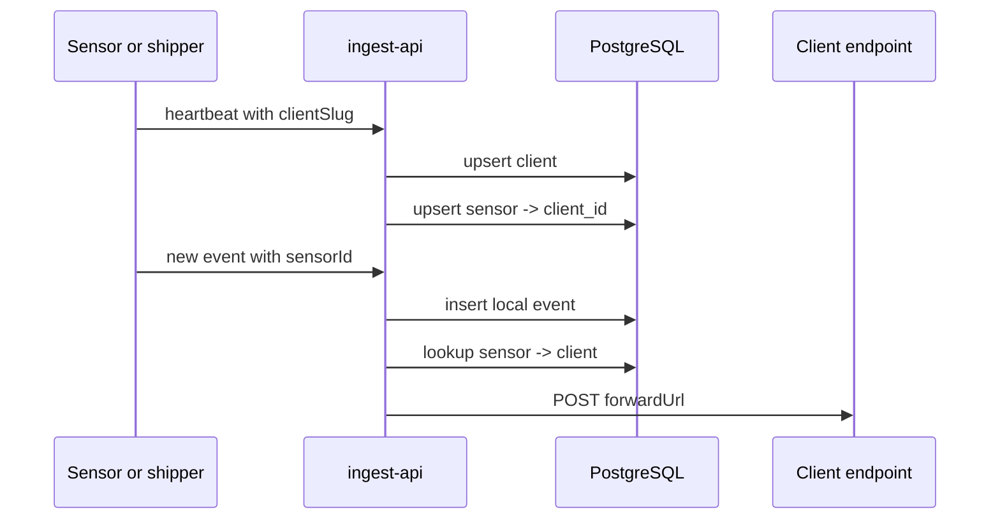

---

## Redes Docker

### Single-host (`docker-compose.prod.single-host.yml`)

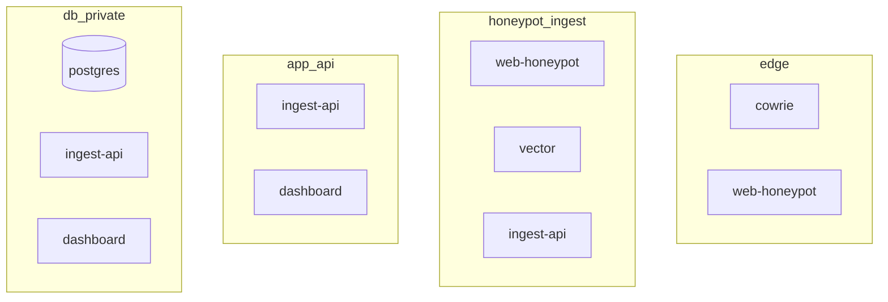

| Red | Servicios | Proposito |
|-----|-----------|-----------|
| `edge` | cowrie, web-honeypot | Solo los servicios expuestos a internet |
| `honeypot_ingest` | web-honeypot, vector, ingest-api | Pipeline de ingesta |
| `app_api` | ingest-api, dashboard | Comunicacion interna app |
| `db_private` | postgres, ingest-api, dashboard | Acceso a base de datos |

**Cowrie no tiene ruta a postgres, ingest-api ni al dashboard.**

### VPS honeypot (`docker-compose.prod.honeypot.yml`)

Una sola red `edge` con todos los servicios de captura: cowrie, web-honeypot, vector. Vector alcanza ingest-api exclusivamente via VPN.

### Servidor app (`docker-compose.prod.app.yml`)

| Red | Servicios | Proposito |
|-----|-----------|-----------|
| `app_api` | ingest-api, dashboard | Comunicacion interna |
| `db_private` | postgres, ingest-api, dashboard | Acceso a base de datos |
| `caddy_net` | caddy, dashboard | Exposicion via HTTPS |

---

## Puertos expuestos

| Puerto | Servicio | Descripcion |
|--------|----------|-------------|
| `22` | Cowrie (prod) | SSH honeypot — los atacantes se conectan aqui |
| `80` | Caddy / web-honeypot | HTTP → HTTPS en two-host; honeypot en single-host |
| `443` | Caddy (two-host) | HTTPS dashboard e ingest-api |
| `21` | FTP honeypot | Puerto FTP en produccion |
| `3306` | MySQL honeypot | Puerto MySQL en produccion |
| `8022` | sshd admin VPS | Acceso SSH real al servidor |
| `2222` | Cowrie (dev) | SSH honeypot en entorno local |
| `8080` | web-honeypot / Galah (dev) | HTTP honeypot en entorno local |
| `127.0.0.1:4000` | dashboard (single-host) | Solo loopback — requiere SSH tunnel |
| `3000` | ingest-api | Solo red interna / VPN. Nunca publico en prod. |
| `5432` | PostgreSQL | Solo red interna. Nunca publico. |

---

## Hardening de contenedores

Todos los servicios en produccion aplican:

```yaml
security_opt:
  - no-new-privileges:true
cap_drop:
  - ALL
pids_limit: 256
```

Adicionalmente:
- `web-honeypot` usa `read_only: true` y corre con usuario sin privilegios
- `caddy` solo tiene `NET_BIND_SERVICE`
- `vector` corre con imagen Alpine minimal

---

## Autorizacion entre servicios

Los sensores (web-honeypot, Vector, Dionaea shipper, heartbeat.py) autorizan sus peticiones a ingest-api via el header `X-Ingest-Token`, cuyo valor es `INGEST_SHARED_SECRET`.

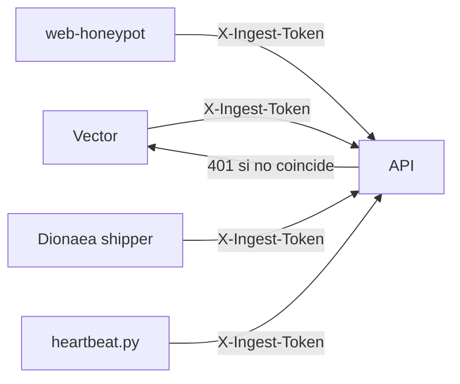

Los endpoints `GET` de ingest-api no requieren autenticacion — estan protegidos por no ser alcanzables desde internet.
