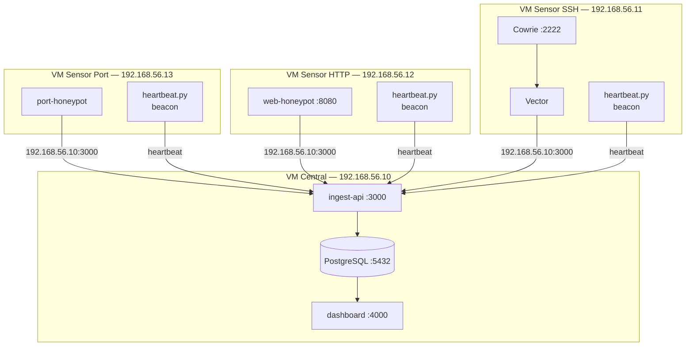

El lab multi-VM local permite simular la arquitectura distribuida de produccion en tu maquina usando VMs separadas. Es util para probar la comunicacion entre sensores y el core antes de hacer un deploy real en VPS.

---

## Topologia



> Puedes tambien usar `docker-compose.local.sensor-ssh-web.yml` en una sola VM para tener Cowrie + web-honeypot juntos, si quieres ahorrar VMs.

---

## Archivos de compose disponibles

| Archivo | VM sugerida | Servicios |
|---------|------------|-----------|
| `docker-compose.local.core.yml` | 192.168.56.10 | postgres, ingest-api, dashboard |
| `docker-compose.local.sensor-cowrie.yml` | 192.168.56.11 | cowrie, cowrie-beacon, vector |
| `docker-compose.local.sensor-web.yml` | 192.168.56.12 | web-honeypot, beacon |
| `docker-compose.local.sensor-ssh-web.yml` | 192.168.56.11 | cowrie + web-honeypot + beacons + vector |
| `docker-compose.local.sensor-port.yml` | 192.168.56.13 | port-honeypot, beacon |

---

## Setup paso a paso

### 1. VM Central

```bash
cp env/local.core.example .env

# Edita .env:
# - POSTGRES_PASSWORD
# - INGEST_SHARED_SECRET    ← este mismo valor va en TODAS las sensor VMs
# - BETTER_AUTH_SECRET
# - NEXT_PUBLIC_API_URL=http://192.168.56.10:3000
# - BETTER_AUTH_URL=http://192.168.56.10:4000

docker compose -f deploy/local/core.yml up --build -d

# Verifica:
curl http://192.168.56.10:3000/health
# → {"status":"ok"}
```

### 2. VM Sensor SSH (Cowrie)

```bash
cp env/local.sensor-cowrie.example .env

# Edita .env:
# - INGEST_API_URL=http://192.168.56.10:3000
# - INGEST_SHARED_SECRET=<mismo que el core>
# - HONEYPOT_IP=192.168.56.11

docker compose -f deploy/local/sensor-cowrie.yml up --build -d

# Verifica heartbeat:
docker logs -f cowrie-beacon
# → [beacon] heartbeat ok  sensor=cowrie-ssh-local-01  protocol=ssh
```

### 3. VM Sensor HTTP

```bash
cp env/local.sensor-web.example .env

# Edita .env:
# - INGEST_API_URL=http://192.168.56.10:3000
# - INGEST_SHARED_SECRET=<mismo que el core>
# - HONEYPOT_IP=192.168.56.12

docker compose -f deploy/local/sensor-web.yml up --build -d
```

### 4. VM Sensor SSH + HTTP (combinados)

Si prefieres una sola VM sensor con Cowrie y web-honeypot:

```bash
cp env/local.sensor-ssh-web.example .env

# Edita .env:
# - INGEST_API_URL=http://192.168.56.10:3000
# - INGEST_SHARED_SECRET=<mismo que el core>
# - HONEYPOT_IP=192.168.56.11

docker compose -f deploy/local/sensor-ssh-web.yml up --build -d
```

### 5. VM Sensor Port Scanner

```bash
cp env/local.sensor-port.example .env

# Edita .env:
# - INGEST_API_URL=http://192.168.56.10:3000
# - INGEST_SHARED_SECRET=<mismo que el core>
# - HONEYPOT_IP=192.168.56.13
# - PORTS=6379 8888 9090 9200 27017    ← ajusta segun lo que quieras monitorear

docker compose -f deploy/local/sensor-port.yml up --build -d
```

---

## Verificar que todo funciona

### Dashboard en la VM central

```
http://192.168.56.10:4000
```

Navega a `/sensors` — deberias ver todas las VMs sensor con estado **Online** y el ultimo heartbeat reciente.

### Generar trafico de prueba

```bash
# Desde cualquier maquina en la red

# SSH honeypot (VM 192.168.56.11)
ssh -p 2222 root@192.168.56.11

# Web honeypot (VM 192.168.56.12)
curl http://192.168.56.12:8080/wp-login.php
curl "http://192.168.56.12:8080/.env"
curl "http://192.168.56.12:8080/search?q=1' OR 1=1--"

# Port scanner (VM 192.168.56.13)
nc -vz 192.168.56.13 6379
nc -vz 192.168.56.13 9200
```

---

## Diferencias con produccion

| Aspecto | Lab multi-VM | Produccion two-host |
|---------|-------------|---------------------|
| Red | LAN local (192.168.56.x) | VPN (Tailscale/WireGuard) |
| HTTPS | No (HTTP directo) | Si (Caddy) |
| Puertos SSH | 2222 (no privilegiados) | 22 (real) |
| Dashboard | Accesible en :4000 directamente | Solo via HTTPS o tunnel |
| Ingest API | Accesible en :3000 directamente | Solo via VPN |

> Los `.env.local.*.example` usan IPs de ejemplo `192.168.56.x` (red host-only de VirtualBox). Ajustalas a las IPs reales de tu entorno. En VMware o WSL2, los rangos de red son distintos.

---

## Comandos utiles

```bash
# Ver todos los servicios del core
docker compose -f deploy/local/core.yml ps

# Ver logs del ingest-api
docker compose -f deploy/local/core.yml logs -f ingest-api

# Apagar todo el core
docker compose -f deploy/local/core.yml down

# Apagar sensor cowrie
docker compose -f deploy/local/sensor-cowrie.yml down

# Apagar y eliminar volumenes del core (reset total)
docker compose -f deploy/local/core.yml down -v
```
