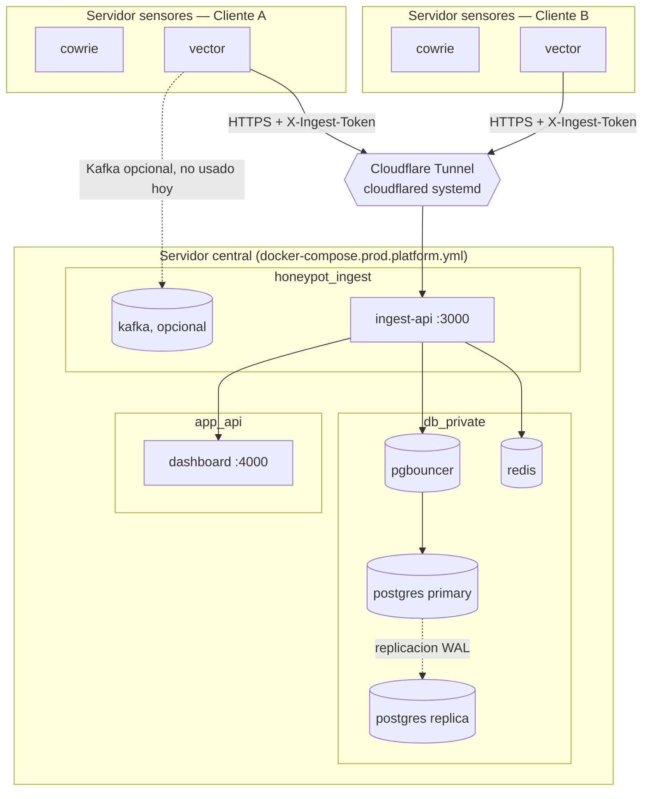

import { Aside, Steps } from '@astrojs/starlight/components';

El modo **platform-only** separa la plataforma (dashboard, ingest-api, Postgres, Kafka) de los honeypots. El servidor central usa `docker-compose.prod.platform.yml` y **no corre ningun honeypot** — cada cliente aloja sus propios sensores en su propio servidor con `docker-compose.prod.honeypot.yml`, y los apunta al servidor central via internet.

Es la topologia pensada para vender el servicio a varios clientes: cada uno tiene su servidor de sensores, pero todos comparten el mismo dashboard y base de datos centralizados, segmentados por `CLIENT_SLUG`.

<Aside type="tip">
A diferencia de [two-host](/deployment/two-host/), que conecta un unico par de servidores por VPN, platform-only esta pensado para **N servidores de sensores** (uno por cliente) hablando con **un unico servidor central** por internet, sin necesidad de una VPN punto a punto por cliente.
</Aside>

## Cuando usar esta topologia

| Escenario | Topologia recomendada |
|-----------|------------------------|
| Un solo cliente/laboratorio, presupuesto minimo | [Single-host](/deployment/single-host/) |
| Un cliente, quieres aislar honeypots de la base de datos | [Two-host con VPN](/deployment/two-host/) |
| Varios clientes, cada uno con su propio servidor de sensores | **Platform-only** |

## Arquitectura



Ver el detalle completo de este diagrama, con redes Docker y puertos, en [Arquitectura del sistema](/architecture/#platform-only-servidor-central--sensores-remotos-multi-cliente).

## Puntos clave

- El servidor central **nunca abre puertos inbound**. `cloudflared` corre como servicio systemd (no en Docker) y hace una conexion saliente hacia Cloudflare; solo `ingest-api:3000` queda accesible, a traves del tunel.
- La IP real del servidor central no aparece en DNS ni en ningun header HTTP — los sensores se conectan a un hostname (`https://ingest.tudominio.com`), no a una IP.
- Cada servidor de sensores es independiente: distinto `CLIENT_SLUG`, distinta maquina, sin necesidad de VPN entre ellos ni con el servidor central.
- `ingest-api` necesita `trustProxy: 'loopback'` para leer la IP real del atacante desde `X-Forwarded-For` — sin esto, todo el trafico detras del tunel se ve como `127.0.0.1`, lo que rompe el allowlist del modulo de defensa de la API.
- La autenticacion de Postgres en esta topologia es `scram-sha-256` (no `md5` como en single-host) — se configura explicitamente en `pgbouncer` con `AUTH_TYPE: scram-sha-256`.
- Reusa el mismo patron de single-host para la base de datos: `pgbouncer` (pooling) delante de `postgres` (primary), con `postgres-replica` en streaming para las lecturas pesadas del dashboard, y `redis` como cache.
- Kafka esta disponible en el servidor central pero **no se usa hoy** para sensores remotos — los sensores llegan por HTTP a traves del tunel, no por Kafka. Ver [Kafka vs HTTP](/architecture/#kafka-vs-http-que-sensor-usa-cada-canal).

## Requisitos previos

- Un servidor central (VPS o servidor propio) con Docker y Docker Compose v2
- Un dominio propio con nameservers en Cloudflare (plan Free alcanza)
- Un servidor por cada cliente para correr sus honeypots (puede ser cualquier topologia de sensor: VPS, VM, servidor fisico)

## Paso 1 — Desplegar el servidor central

<Steps>

1. Clonar el repo en el servidor central:

   ```bash
   git clone <repo-url>
   cd honeypot-ai
   ```

2. Definir las variables de entorno:

   ```bash
   export POSTGRES_PASSWORD=$(openssl rand -base64 32)
   export REPLICATION_PASSWORD=$(openssl rand -base64 32)
   export INGEST_SHARED_SECRET=$(openssl rand -base64 32)
   export BETTER_AUTH_SECRET=$(openssl rand -base64 32)
   export BETTER_AUTH_URL=https://ingest.tudominio.com
   ```

3. Levantar el stack (sin honeypots — solo plataforma):

   ```bash
   docker compose -f docker-compose.prod.platform.yml up --build -d
   docker compose -f docker-compose.prod.platform.yml ps
   ```

4. Esperar a que todos los servicios esten `healthy`. El orden de arranque es el mismo que en single-host: `postgres` → `postgres-replica`/`pgbouncer`/`redis`/`kafka` en paralelo → `kafka-init` → `ingest-api` → `dashboard`.

</Steps>

## Paso 2 — Exponer `ingest-api` con Cloudflare Tunnel

Sigue la guia completa en [`docs/project-notes/CLOUDFLARE_TUNNEL_SETUP.md`](https://github.com/elrichi31/honeypot-ai/blob/master/docs/project-notes/CLOUDFLARE_TUNNEL_SETUP.md) del repo. Resumen de los pasos:

<Steps>

1. Agregar tu dominio a Cloudflare (plan Free) y apuntar los nameservers.
2. Instalar `cloudflared` en el servidor central (paquete apt oficial de Cloudflare).
3. Autenticar: `cloudflared tunnel login`.
4. Crear el tunel: `cloudflared tunnel create honeytrap-ingest`.
5. Crear `/root/.cloudflared/config.yml` mapeando tu hostname a `http://localhost:3000`:

   ```yaml
   tunnel: <TUNNEL-UUID>
   credentials-file: /root/.cloudflared/<TUNNEL-UUID>.json

   ingress:
     - hostname: ingest.tudominio.com
       service: http://localhost:3000
     - service: http_status:404
   ```

6. Crear el registro DNS: `cloudflared tunnel route dns honeytrap-ingest ingest.tudominio.com`.
7. Probar en foreground antes de instalar como servicio:

   ```bash
   cloudflared tunnel --config /root/.cloudflared/config.yml run honeytrap-ingest
   curl -s https://ingest.tudominio.com/health
   ```

8. Instalar como servicio systemd:

   ```bash
   sudo cloudflared --config /root/.cloudflared/config.yml service install
   sudo systemctl enable --now cloudflared
   ```

</Steps>

<Aside type="danger">
`ingest-api` debe correr con `trustProxy: 'loopback'` (ya configurado en el codigo base) para que la IP real del atacante llegue via `X-Forwarded-For` a traves del tunel. Sin esto, el dashboard mostraria `127.0.0.1` como origen de todos los ataques, y el modulo de defensa de la API no podria aplicar su allowlist correctamente.
</Aside>

## Paso 3 — Levantar un servidor de sensores por cliente

En **cada** servidor de cliente, clona el repo y levanta solo el compose de honeypots:

```bash
git clone <repo-url>
cd honeypot-ai

export CLIENT_SLUG=cliente-a
export CLIENT_NAME="Cliente A"
export INGEST_API_URL=https://ingest.tudominio.com
export INGEST_SHARED_SECRET=<el-mismo-secret-del-servidor-central>

docker compose -f docker-compose.prod.honeypot.yml up --build -d
docker compose -f docker-compose.prod.honeypot.yml ps
```

Repite este paso para cada cliente nuevo, con su propio `CLIENT_SLUG` y su propio servidor. Todos comparten el mismo `INGEST_SHARED_SECRET` y el mismo hostname de `INGEST_API_URL`.

<Aside>
`docker-compose.prod.honeypot.yml` no incluye Kafka — todos los sensores envian por HTTP (con buffer en disco de Vector para Cowrie/Suricata cuando Kafka no esta disponible localmente, y HTTP directo para el resto). Ver [Kafka vs HTTP](/architecture/#kafka-vs-http-que-sensor-usa-cada-canal).
</Aside>

## Paso 4 — Acceder al dashboard

El dashboard queda en `127.0.0.1:4000` del servidor central, igual que en single-host — nunca expuesto publicamente. Usa un tunel SSH:

```bash
ssh -L 4000:127.0.0.1:4000 -p <puerto-ssh> <usuario>@<ip-servidor-central>
# Abre http://localhost:4000
```

O usa una VPN (Tailscale/WireGuard) si ya tienes una entre tu maquina y el servidor central.

## Verificar el flujo completo

Desde el servidor de un cliente, confirma que el sensor llega al servidor central:

```bash
curl -s https://ingest.tudominio.com/health
# {"status":"ok"}

docker compose -f docker-compose.prod.honeypot.yml logs -f vector
# INFO vector::sinks::http: Request finished. status=200 ...
```

En el dashboard (via tunel SSH), confirma que el nuevo cliente aparece en `/clients` con eventos entrando en tiempo real.

## Comandos de mantenimiento

```bash
# Servidor central — logs
docker compose -f docker-compose.prod.platform.yml logs -f ingest-api
docker compose -f docker-compose.prod.platform.yml logs -f dashboard

# Servidor central — estado de servicios
docker compose -f docker-compose.prod.platform.yml ps

# Servidor central — pool de conexiones de pgbouncer
docker compose -f docker-compose.prod.platform.yml exec pgbouncer \
  psql -h localhost -p 5432 -U postgres pgbouncer -c "SHOW POOLS;"

# Servidor de un cliente — logs de sus honeypots
docker compose -f docker-compose.prod.honeypot.yml logs -f cowrie

# Cloudflare Tunnel — logs del servicio
sudo journalctl -u cloudflared -f
```

## Recomendaciones de seguridad

- No expongas los puertos `4000` (dashboard), `5432` (postgres/pgbouncer), `9092`/`9093` (Kafka) ni `6379` (Redis) publicamente — solo `3000` (ingest-api) queda accesible, y unicamente a traves del tunel de Cloudflare.
- Rota `POSTGRES_PASSWORD`, `REPLICATION_PASSWORD`, `INGEST_SHARED_SECRET` y `BETTER_AUTH_SECRET` periodicamente.
- Cada servidor de cliente usa su propio `CLIENT_SLUG` — nunca reutilices un slug entre clientes distintos, o sus eventos se mezclaran en el dashboard.
- Si usas Cloudflare Bot Fight Mode u otras reglas WAF en el dominio, agrega una excepcion para las rutas `/sensors/`, `/ingest/` y `/health` — de lo contrario Cloudflare puede bloquear el trafico de los sensores con un 403.
