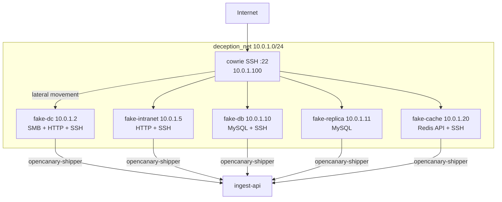

import { Aside } from '@astrojs/starlight/components';

La **red de engaño** convierte la "red interna" que ve un atacante dentro de Cowrie en algo real. Cuando logra entrar por SSH y trata de moverse lateralmente hacia los hosts internos, esos hosts son nodos trampa [OpenCanary](https://github.com/thinkst/opencanary) que capturan cada interacción.

- **Backend:** `apps/ingest-api/src/routes/deception.ts`.
- **Dashboard:** `/deception` (+ componentes en `apps/dashboard/components/deception/`).
- **Diseño:** `docs/plans/PLAN_DECEPTION.md`.

---

## La idea

El `/etc/hosts` y los archivos falsos de Cowrie ya referencian IPs internas
`10.0.1.x`. Al conectar Cowrie a una red Docker `10.0.1.0/24` y asignar esas
mismas IPs a contenedores OpenCanary, cuando el atacante hace `ssh 10.0.1.10`
**realmente llega a un nodo trampa**.

| Nodo | IP | Servicios simulados |
|------|----|--------------------|
| `fake-dc` | 10.0.1.2 | HTTP (portal AD), SMB, SSH |
| `fake-intranet` | 10.0.1.5 | HTTP (intranet), SSH |
| `fake-db` | 10.0.1.10 | MySQL, SSH |
| `fake-replica` | 10.0.1.11 | MySQL |
| `fake-cache` | 10.0.1.20 | HTTP (Redis API falsa), SSH |

Un único **opencanary-shipper** lee los logs JSON de todos los nodos y los envía al ingest-api (mismo patrón que el shipper de Dionaea), marcados con `data.source = "opencanary"`. Los nodos se registran como sensores con `protocol = "deception"`.

---

## Kill-chain

El sistema correlaciona las interacciones de un mismo atacante en una **cadena de ataque** cronológica:

1. Login SSH exitoso en Cowrie.
2. El atacante lee `/etc/hosts` y descubre las IPs internas.
3. Intenta `ssh 10.0.1.10` → `fake-db` captura.
4. Prueba MySQL en `10.0.1.10:3306` → captura.
5. Salta a `10.0.1.11` → otra interacción.

La correlación se hace preferentemente por `session_id` (misma sesión Cowrie) y, como respaldo, por IP interna + ventana temporal.

---

## Endpoints

| Método | Path | Qué devuelve |
|--------|------|--------------|
| `GET` | `/deception/overview` | Nodos totales/online, hits 24h/7d, auth 24h, IPs internas únicas |
| `GET` | `/deception/nodes` | Estado de cada nodo trampa |
| `GET` | `/deception/killchain` | Cadenas de ataque correlacionadas |
| `GET` | `/deception/events` | Interacciones con nodos (paginado) |
| `GET` | `/deception/portscans` | Port scans internos (paginado) |
| `POST` | `/ingest/deception/portscan` | Ingesta de un port scan interno |

Cada `GET` tiene su variante por cliente en `/clients/:clientSlug/deception/*`. Ver [API Reference](/api-reference/#red-de-engano).

---

## Relacionados

- [SSH Honeypot (Cowrie)](/services/cowrie/) — el punto de entrada.
- [Threat Intelligence](/intelligence/threat-intelligence/) — `lateral_movement` suma al risk score.
- [Arquitectura](/architecture/#pipeline-red-de-engano-opencanary--ingest-api).
