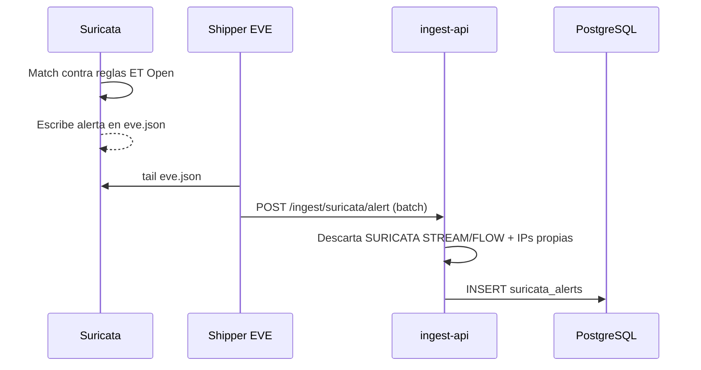

import { Aside } from '@astrojs/starlight/components';

[Suricata](https://suricata.io/) es un **IDS** (sistema de detección de intrusiones) que inspecciona el tráfico de red de los sensores contra el ruleset **ET Open** y emite alertas en formato EVE JSON. La plataforma las ingiere, deduplica el ruido y las presenta con estadísticas.

- **Sensor:** `sensors/suricata`.
- **Backend:** `apps/ingest-api/src/routes/suricata.ts`.
- **Dashboard:** `/suricata`.

---

## Pipeline

Las alertas se ingieren por `POST /ingest/suricata/alert` (objeto único o array). Ver el formato en la [API Reference](/api-reference/#ingesta-suricata-ids).

---

## Filtrado de ruido

- Las firmas internas `SURICATA STREAM` y `SURICATA FLOW` se **descartan** al ingerir.
- Las IPs propias del despliegue, definidas en la variable `SURICATA_OWN_IPS`, se filtran para no contaminar las estadísticas con tráfico legítimo.
- El dashboard expone toggles `hideNoise` y `excludeOwnIps`.

---

## Vista del dashboard

`/suricata` muestra, por rango **24h / 7d / 30d**:

- total de alertas y conteo por severidad,
- **top firmas** disparadas,
- **top IPs** de origen,
- timeline de alertas,
- tabla buscable y filtrable por severidad, IP de origen y texto (firma/categoría).

---

## Tabla `suricata_alerts`

| Campo | Descripción |
|-------|-------------|
| `sensor_id` | Sensor que generó la alerta |
| `timestamp` | Momento del evento |
| `src_ip` / `src_port` | Origen |
| `dest_ip` / `dest_port` | Destino |
| `proto` | Protocolo de red |
| `signature_id` / `signature` | Regla disparada |
| `category` | Categoría de la regla |
| `severity` | Severidad (1 = más alta) |
| `action` | `allowed` / `blocked` |
| `flow_id` | Identificador de flujo |

---

## Relacionados

- [Threat Intelligence](/intelligence/threat-intelligence/) — correlación a nivel de aplicación.
- [Arquitectura](/architecture/#pipeline-suricata-ids--ingest-api) — el pipeline completo.
