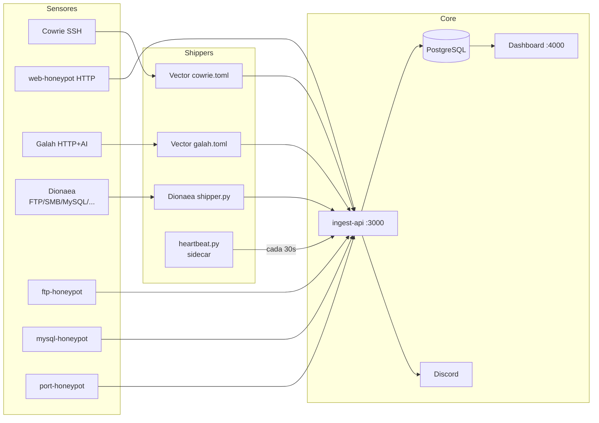

Honeypot Platform es una plataforma de investigacion de seguridad que captura trafico SSH, HTTP, FTP, MySQL y port scans maliciosos, normaliza los eventos en una API centralizada y los visualiza en un dashboard con analisis de amenazas, correlacion cross-protocol, risk scoring por IP, clasificacion automatica de sesiones con IA y alertas en Discord.

El objetivo es observar comportamiento real de atacantes: que credenciales prueban, que comandos ejecutan, que rutas web escanean, y con que herramientas operan — todo desde una sola interfaz.

---

## Stack

| Capa | Tecnologia | Por que |
|------|-----------|---------|
| Honeypot SSH | [Cowrie](https://github.com/cowrie/cowrie) (custom build) | SSH/Telnet de media interaccion con honeyfs y txtcmds personalizados. |
| Honeypot HTTP | Flask + Gunicorn | Rutas falsas con respuestas realisticas a scanners. |
| Honeypot HTTP AI | [Galah](https://github.com/0x4D31/galah) | Genera respuestas HTTP via LLM — cualquier path, cualquier payload. |
| Honeypot multi-protocolo | [Dionaea](https://github.com/DinoTools/dionaea) | FTP, MySQL, SMB, MSSQL, RPC, TFTP, MQTT, PPTP desde un solo sensor. |
| Honeypots de red | Python asyncio | Emulaciones ligeras para FTP, MySQL y puertos comunmente escaneados. |
| Log shipper | [Vector 0.40](https://vector.dev) | Tail con offset persistente en disco, buffer 256 MB, retry automatico. Configs para Cowrie y Galah. |
| Sensor beacon | Python (`heartbeat.py`) | Sidecar generico que registra cada sensor via `POST /sensors/heartbeat`. |
| API de ingesta | Fastify + TypeScript | Alta performance, schema validation, healthcheck nativo. |
| ORM / DB | Prisma + PostgreSQL | Migraciones declarativas, type-safety end-to-end. |
| Dashboard | Next.js 16 (App Router) | Server Components, fetch en el servidor. |
| Auth | better-auth | Sesiones seguras con soporte de multiples providers. |
| Alertas | Discord webhooks | Alertas con risk scoring, cooldowns y detalle de amenaza. |
| Graficas | recharts | Time series composables. |
| Mapas | react-simple-maps + geoip-lite | Geolocalizacion offline sin API keys externas. |
| Contenedores | Docker Compose | Entorno reproducible, networks aisladas, hardening declarativo. |
| Documentacion | Astro Starlight | Este sitio (`apps/docs/`). |

---

## Funcionalidades principales

- **Dashboard en tiempo real** — sesiones, comandos, credenciales, campanas, web attacks, amenazas
- **Mapa de ataques en vivo** — stream SSE que pinta cada ataque en el mapa conforme sucede
- **Sensor health monitoring** — estado online/offline de todos los sensores con heartbeat cada 30s
- **Multi-sensor** — Cowrie, web-honeypot, Galah, Dionaea, ftp/mysql/port-honeypot, Suricata y OpenCanary en paralelo
- **Clasificacion de sesiones** — Bot, Bot Script, Scanner, Brute-Force, Interactive, Recon, Malware Dropper
- **Risk scoring por IP** — score 0-100 basado en comandos, protocolos y comportamiento cross-protocol
- **Detección de intrusiones (IDS)** — alertas Suricata con reglas ET Open, severidades y top firmas
- **Red de engaño** — nodos trampa internos que reconstruyen la kill-chain del movimiento lateral
- **Captura de malware** — binarios de Dionaea, descargas de Cowrie y uploads de FTP, con lookup en MalwareBazaar
- **IoCs exportables** — IPs maliciosas y hashes en CSV/JSON
- **IP Enrichment** — AbuseIPDB e ipinfo.io (ASN, geolocalizacion, privacy flags)
- **AI threat analysis** — resumen de sesiones con OpenAI, TTPs y nivel de peligro
- **Alertas Discord** — notificacion instantanea con breakdown de riesgo y cooldown por IP
- **Multi-tenant** — aislamiento de datos por cliente; el superadmin ve global o por tenant
- **Monitoreo del servidor** — CPU, RAM, Redis y contenedores
- **Almacenamiento y retención** — tamaño de la BD por tabla y purga automática configurable
- **Defensa de la API** — bloqueo de scanners/inyecciones/fuerza bruta contra la propia ingest-api
- **Attack heatmap** — mapa de calor 7x24 de cuando atacan mas
- **Gestion de usuarios** — crear y eliminar cuentas de acceso al dashboard con contrasenas hasheadas
- **Audit log** — registro completo de quien creo, modifico o elimino que recurso y cuando
- **Lab multi-VM** — topologia local para desarrollo con VMs separadas

---

## Flujo de datos



---

## Estructura del repositorio

```
.
├── docker-compose.yml                     # Dev: todo en un host (incluye Kafka + Redis)
├── docker-compose.prod.single-host.yml    # Prod: un solo VPS (Kafka, pgbouncer, replica, redis)
├── docker-compose.prod.honeypot.yml       # Prod: VPS de sensores (sin Kafka)
├── docker-compose.prod.app.yml            # Prod: servidor app (two-host, postgres directo + redis)
├── docker-compose.prod.platform.yml       # Prod: servidor central platform-only (multi-cliente)
├── deploy/
│   └── local/                             # Lab multi-VM: un compose por VM
│       ├── core.yml                       # VM central: postgres, ingest-api, dashboard
│       ├── sensor-cowrie.yml              # VM sensor SSH: cowrie, cowrie-beacon, vector
│       ├── sensor-web.yml                 # VM sensor HTTP: web-honeypot
│       ├── sensor-ssh-web.yml             # VM combinada: cowrie + web-honeypot
│       └── sensor-port.yml                # VM sensor de puertos: port-honeypot
├── env/                                   # Plantillas .env.example por topologia
├── sensors/
│   ├── cowrie/                            # Cowrie custom build
│   │   ├── Dockerfile
│   │   ├── cowrie.cfg
│   │   ├── userdb.txt
│   │   ├── heartbeat.py                   # Beacon sidecar (unico sensor con beacon separado)
│   │   ├── patch_auth.py
│   │   ├── honeyfs/                       # Filesystem falso (/etc, /home, /proc)
│   │   └── txtcmds/                       # Salidas falsas de comandos
│   ├── galah/                             # Honeypot HTTP con IA
│   │   ├── Dockerfile
│   │   └── config/config.yaml
│   ├── dionaea/                           # Sensor multi-protocolo (FTP, SMB, MSSQL, MySQL, HTTP)
│   │   ├── docker-compose.local.yml
│   │   ├── docker-compose.sensor.yml
│   │   ├── shipper.py
│   │   └── services-enabled/
│   ├── suricata/                          # IDS, envia por Kafka
│   ├── opencanary/                        # Red de engano
│   ├── web-honeypot/
│   ├── ftp-honeypot/
│   ├── mysql-honeypot/
│   ├── port-honeypot/
│   └── smb-honeypot/
├── vector/
│   ├── cowrie.toml                        # Shipper Cowrie → Kafka
│   ├── suricata.toml                      # Shipper Suricata → Kafka
│   ├── galah.toml                         # Shipper Galah → HTTP
│   ├── web-honeypot.toml
│   └── protocol.toml
└── apps/
    ├── ingest-api/
    │   ├── src/
    │   │   ├── modules/         # route→service→repository por dominio (ingest, alerts, sensors, threats, web, clients, malware...)
    │   │   └── lib/             # risk-score, bot-detector, threat-alerts, discord, cron
    │   └── prisma/
    ├── dashboard/
    │   ├── app/                 # /sensors /threats /campaigns /web-attacks /settings /setup
    │   ├── components/
    │   └── lib/
    └── docs/                    # Esta documentacion (Astro Starlight)
```
