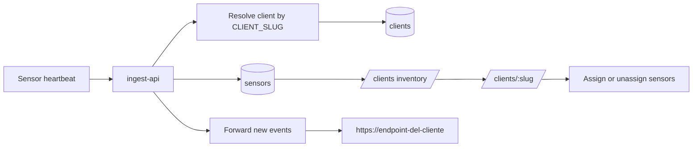
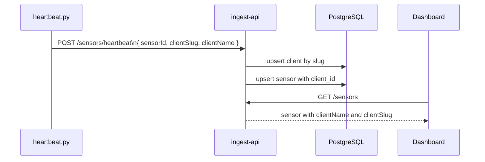

import { Aside } from '@astrojs/starlight/components';

La plataforma ahora soporta una capa multi-cliente simple: cada sensor puede pertenecer a un cliente, el dashboard los separa visualmente y el ingest-api puede reenviar eventos nuevos al endpoint propio de ese cliente.

---

## Que resuelve

- Separar sensores por cliente dentro del dashboard.
- Crear clientes desde `/clients` sin tocar la base de datos a mano.
- Asignar o desasignar sensores ya registrados.
- Auto-asociar sensores cuando llegan heartbeats con `CLIENT_SLUG`.
- Forwardear cada evento nuevo del cliente a una URL dedicada.



---

## Flujo de UI

### 1. Crear cliente

En `/clients` existe el inventario de clientes. El flujo es:

1. Click en `+ Add Client`.
2. Se abre un modal con `name`, `slug`, `description` y `forwardUrl`.
3. Al guardar, el cliente aparece en el inventario.
4. Desde esa misma tarjeta puedes entrar al detalle del cliente.

### 2. Asignar sensores

La asignacion ya no se hace en el inventario. Cuando entras a `/clients/:slug` ves:

- sensores asignados
- sensores sin asignar
- boton `Assign`
- boton `Unassign`
- bloque `Client Forwarding`

### 3. Desasignar sensores

`Unassign` hace `PUT /sensors/:sensorId/client` con `clientId: null`, por lo que el sensor vuelve al grupo de no asignados sin dejar de reportar heartbeats.

---

## Auto-asignacion por heartbeat

Si un sensor arranca con estas variables:

```bash
CLIENT_SLUG=cliente-a
CLIENT_NAME=Cliente A
```

el beacon `heartbeat.py` las envia a `POST /sensors/heartbeat` y el ingest-api:

1. busca un cliente con ese slug
2. si no existe, lo crea automaticamente
3. actualiza el `sensor.client_id`

Eso permite levantar sensores ya "ruteados" al cliente correcto sin entrar primero al dashboard.



---

## Forwarding por cliente

Cada cliente puede tener una `Forward URL`, por ejemplo:

```text
https://ingestapi.com/alerts/cop-pz
```

Cuando llega un evento nuevo desde un sensor asignado a ese cliente, el ingest-api hace un `POST` asincrono y best-effort a esa URL.

### Eventos que se forwardean

- `cowrie.event`
- `web.event`
- `protocol.event`

### Lo que si hace

- solo reenvia eventos nuevos
- incluye metadata del cliente y del sensor
- envia headers `X-Honeypot-Client` y `X-Honeypot-Sensor`

### Lo que no hace todavia

- no reenvia historicos
- no tiene cola persistente
- no reintenta fuera del proceso actual

<Aside type="note">
El forwarding ocurre despues de insertar el evento localmente. Si el endpoint remoto falla, el dato igual queda guardado en PostgreSQL y solo se registra un warning en logs.
</Aside>

### Payload de ejemplo

```json
{
  "kind": "web.event",
  "receivedAt": "2026-05-10T17:42:11.201Z",
  "client": {
    "id": "cl_123",
    "name": "Cliente A",
    "slug": "cliente-a"
  },
  "sensor": {
    "sensorId": "web-prod-01",
    "name": "Web Honeypot - Berlin",
    "protocol": "http",
    "ip": "203.0.113.10"
  },
  "event": {
    "eventId": "0d04c3f9-7303-4f8b-b0f1-55817d58cbd7",
    "sensorId": "web-prod-01",
    "timestamp": "2026-05-10T17:42:10.000Z",
    "srcIp": "198.51.100.20",
    "method": "GET",
    "path": "/wp-login.php",
    "query": "",
    "userAgent": "curl/8.0",
    "headers": {
      "host": "honeypot.example"
    },
    "body": "",
    "attackType": "scanner"
  }
}
```

---

## Endpoints involucrados

| Endpoint | Uso |
|----------|-----|
| `GET /clients` | Lista clientes |
| `POST /clients` | Crea o actualiza un cliente por slug |
| `PATCH /clients/:clientId` | Edita descripcion o `forwardUrl` |
| `GET /sensors` | Lista sensores con `clientName` y `clientSlug` |
| `PUT /sensors/:sensorId/client` | Asigna o desasigna un sensor |
| `POST /sensors/heartbeat` | Auto-registro y auto-asignacion por `clientSlug` |

---

## Recomendaciones de operacion

- Usa un `CLIENT_SLUG` estable, corto y en minusculas.
- Si un mismo host debe servir a clientes distintos, separa los sensores en stacks o `compose` distintos.
- Deja `forwardUrl` vacio si no quieres reenvio externo.
- Si un sensor ya existia sin cliente, puedes asignarlo luego desde `/clients/:slug`.

---

## Variables relacionadas

| Variable | Donde vive | Uso |
|----------|------------|-----|
| `CLIENT_SLUG` | beacon / sensor compose | Asocia el sensor a un cliente |
| `CLIENT_NAME` | beacon / sensor compose | Nombre legible usado al autocrear el cliente |
| `SENSOR_ID` | beacon y algunos shippers | Identifica el sensor para routing y forwarding |

Ver tambien [Sensor Health Monitoring](/services/sensors/), [Ingest API](/services/ingest-api/) y [API Reference](/api-reference/).
