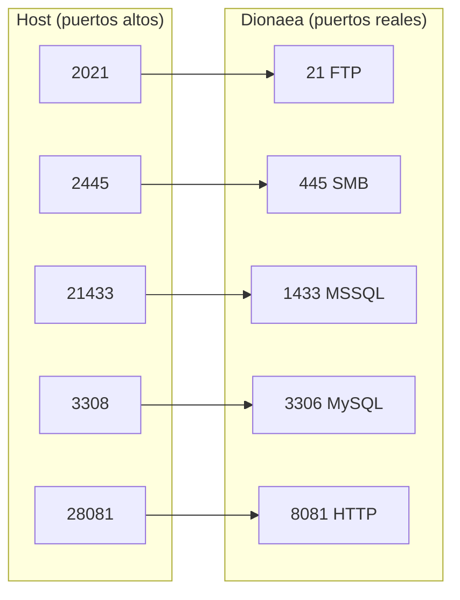

import { Aside } from '@astrojs/starlight/components';

[Dionaea](https://github.com/DinoTools/dionaea) es un honeypot de alta interaccion que emula servicios vulnerables en multiples protocolos. En esta plataforma se usa como sensor externo que captura conexiones y las envia al ingest-api central via `shipper.py`.

## Por que Dionaea

Dionaea cubre protocolos que Cowrie y el web-honeypot no manejan:

| Protocolo | Puerto default | Que captura |
|-----------|---------------|-------------|
| FTP | 21 | Conexiones, intentos de login, uploads |
| MySQL | 3306 | Conexiones, intentos de autenticacion |
| SMB | 445 | Conexiones, intentos de explotacion EternalBlue/WannaCry |
| MSSQL | 1433 | Conexiones, autenticacion |
| RPC / EPMAP | 135 | Endpoint Mapper, enumeration |
| TFTP | 69 | Peticiones de archivo |
| MQTT | 1883 | Conexiones IoT/broker |
| PPTP | 1723 | VPN tunnels |
| HTTP | 8080 | Peticiones HTTP basicas |

---

## Arquitectura de la integracion

```mermaid
graph TD
    subgraph "Host Dionaea"
        DI[Dionaea\nghcr.io/telekom-security/dionaea:24.04.1]
        JSON[/opt/dionaea/var/lib/dionaea/dionaea.json]
        SH[shipper.py]
        HB[heartbeat.py]
    end

    subgraph "Core HoneyTrap"
        API[ingest-api :3000]
        DB[(PostgreSQL)]
        DASH[Dashboard /sensors\n/services]
    end

    DI --> JSON
    SH -->|tail + parse| JSON
    SH -->|POST /ingest/protocol/event| API
    HB -->|POST /sensors/heartbeat\ncada 30s| API
    API --> DB --> DASH
```

---

## Shipper (`sensors/dionaea/shipper.py`)

El shipper es un proceso Python que:
1. Hace **tail** de `dionaea.json` con offset persistente (no re-procesa eventos al reiniciar)
2. Parsea eventos `connect` del `log_json` ihandler de Dionaea
3. Envia cada evento a `POST /ingest/protocol/event` con el schema de protocol hit
4. Envia un **heartbeat** al arrancar y cada 30 segundos

### Schema de evento enviado

```json
{
  "sensorId": "dionaea-sensor-01",
  "protocol": "smb",
  "srcIp": "1.2.3.4",
  "srcPort": 54321,
  "dstPort": 445,
  "eventType": "connect",
  "timestamp": "2024-01-15T10:30:00.000Z",
  "data": { /* raw Dionaea metadata */ }
}
```

<Aside type="note">
El MVP actual captura solo eventos de tipo `connect`. Los eventos mas ricos de Dionaea (descargas de malware, capturas de artefactos, semantica especifica por protocolo) se pueden agregar en versiones futuras.
</Aside>

---

## Archivos de configuracion

### `sensors/dionaea/log_json.yaml`

Configura el ihandler `log_json` de Dionaea para escribir eventos en formato JSON. Montar como volumen en el contenedor.

### `sensors/dionaea/services-enabled/`

Contiene los servicios activos de Dionaea. Cada archivo `.yaml` habilita un protocolo:

```
services-enabled/
├── epmap.yaml    # RPC Endpoint Mapper
├── ftp.yaml      # FTP
├── http.yaml     # HTTP
├── mirror.yaml   # Mirror service
├── mqtt.yaml     # MQTT
├── mssql.yaml    # Microsoft SQL Server
├── mysql.yaml    # MySQL
├── pptp.yaml     # PPTP VPN
├── smb.yaml      # SMB / Windows file sharing
└── tftp.yaml     # TFTP
```

---

## Deploy modelo

### Sensor remoto (`docker-compose.sensor.yml`)

Para un host sensor externo que envia eventos a un core central:

```bash
# En el host sensor:
cd sensors/dionaea

# Crear .env con los valores del core central
cat > .env << EOF
INGEST_API_URL=https://api.midominio.com
INGEST_SHARED_SECRET=<mismo-secret-que-el-core>
SENSOR_ID=dionaea-vps-01
SENSOR_NAME="Dionaea Sensor - VPS Berlin"
EOF

docker compose -f docker-compose.sensor.yml up -d
```

---

## Desarrollo local (`docker-compose.local.yml`)

Para testear junto al stack local de desarrollo sin chocar con puertos del sistema:

```bash
cd sensors/dionaea
cp .env.local.example .env.local
# Edita .env.local: ajusta INGEST_SHARED_SECRET

docker compose --env-file .env.local -f docker-compose.local.yml up -d
```

### Puertos remapeados en modo local



Esto evita conflictos con los honeypots locales (ftp-honeypot en `:2121`, mysql-honeypot en `:3307`, etc.).

### Generar trafico de prueba

```bash
# Linux/Mac
nc localhost 2021        # FTP
nc localhost 2445        # SMB
nc localhost 21433       # MSSQL
nc localhost 3308        # MySQL
curl http://localhost:28081/
```

```powershell
# Windows PowerShell
Test-NetConnection 127.0.0.1 -Port 2021
Test-NetConnection 127.0.0.1 -Port 2445
Test-NetConnection 127.0.0.1 -Port 21433
Test-NetConnection 127.0.0.1 -Port 3308
curl http://127.0.0.1:28081/
```

### Verificar que los eventos llegan

```bash
# Ver logs del shipper
docker compose --env-file .env.local -f docker-compose.local.yml logs -f dionaea-shipper

# Consultar en la base de datos
docker compose exec postgres psql -U honeypot -d honeypot_prod \
  -c "SELECT protocol, src_ip, dst_port, event_type, timestamp FROM protocol_hits ORDER BY timestamp DESC LIMIT 20;"
```

---

## Variables de entorno

| Variable | Descripcion |
|----------|-------------|
| `INGEST_API_URL` | URL del core central, ej: `http://192.168.56.10:3000` |
| `INGEST_SHARED_SECRET` | Mismo secret que el core |
| `SENSOR_ID` | ID unico del sensor, ej: `dionaea-vps-berlin-01` |
| `SENSOR_NAME` | Nombre legible que aparece en `/sensors` |
| `DIONAEA_LOG_PATH` | Ruta al `dionaea.json` en el contenedor (default: `/opt/dionaea/var/lib/dionaea/dionaea.json`) |

---

## Imagen Docker

Se usa la imagen oficial del proyecto T-Pot:

```
ghcr.io/telekom-security/dionaea:24.04.1
```

Si tu instalacion usa rutas distintas (`/opt/dionaea` vs otras), ajusta:
- `DIONAEA_LOG_PATH` en el `.env`
- El volumen montado para `log_json.yaml`
- Los mounts del `docker-compose`

---

## Notas de seguridad

<Aside type="caution">
Dionaea emula servicios vulnerables de forma deliberada. No lo expongas en un host de produccion junto a servicios reales. Usa un VPS dedicado o una VM aislada.
</Aside>

- Los puertos `445` (SMB) y `135` (RPC) son especialmente sensibles en Windows. En Linux con Docker, no son un riesgo real, pero el firewall del host debe estar configurado correctamente.
- `NET_BIND_SERVICE` es necesaria para que Dionaea pueda bindear en puertos < 1024.
