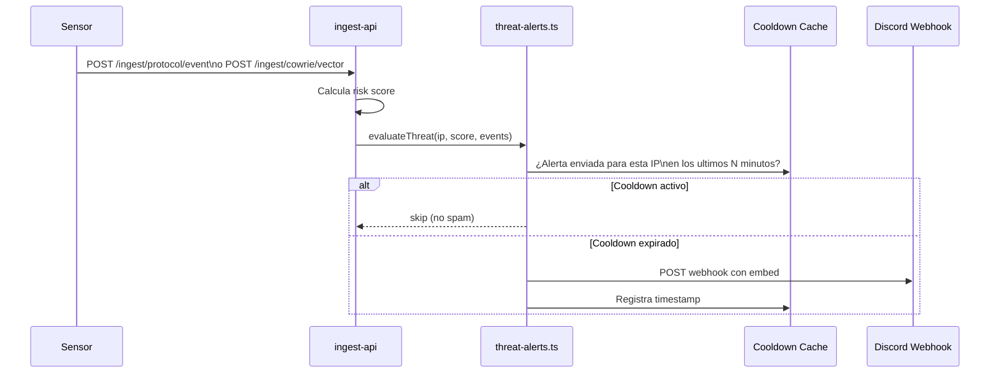

import { Aside } from '@astrojs/starlight/components';

El sistema de alertas Discord notifica automaticamente cuando una IP supera el umbral de risk score. Las alertas incluyen el breakdown de riesgo, protocolos involucrados y acciones recomendadas.

---

## Flujo de alertas



---

## Configuracion

### Via variable de entorno

```bash
DISCORD_WEBHOOK_URL=https://discord.com/api/webhooks/<id>/<token>
```

### Via dashboard (Settings)

Navega a `/settings` → **Notifications** → pega el webhook URL → Save.

La configuracion via dashboard se guarda en la base de datos y tiene prioridad sobre la variable de entorno.

---

## Crear un webhook en Discord

1. Abre el canal de Discord donde quieres recibir las alertas
2. Click en **Editar canal** (icono de engranaje)
3. **Integraciones** → **Webhooks** → **Nuevo Webhook**
4. Copia la **Webhook URL**
5. Pegala en `DISCORD_WEBHOOK_URL` o en `/settings`

---

## Tipos de alertas

### Amenaza de alto riesgo

Se dispara cuando una IP supera el umbral de risk score configurado (default: 70).

```
🚨 High Threat Detected

IP: 1.2.3.4 (China, AS4134)
Risk Score: 87/100 — CRITICAL

Breakdown:
  SSH Commands: +35 (malware_drop, persistence)
  Login Success: +20
  Multi-protocol: +15 (SSH + HTTP)
  Web Attacks: +17 (sqli, cmdi)

Events: 234 total across 3 protocols
First seen: 2024-01-15 08:12 UTC
Last seen:  2024-01-15 10:45 UTC

[View Threat Profile →]
```

### Login SSH exitoso

Se dispara cuando un atacante hace login exitoso en Cowrie.

```
⚠️ SSH Login Success

IP: 5.6.7.8
User: root
Password: 123456
Session: abc123def

[View Session →]
```

---

## Cooldowns

El sistema implementa cooldowns por IP para evitar spam:

- Una vez enviada una alerta para una IP, no se vuelve a enviar hasta que el cooldown expire
- El cooldown default es **60 minutos** por IP
- Si el risk score sube significativamente durante el cooldown, puede disparar una nueva alerta

---

## Probar las alertas

```bash
# Test via endpoint dedicado
curl -X POST http://localhost:3000/api/alerts/test \
  -H "Content-Type: application/json"

# O desde el dashboard en /settings → Test Alert
```

<Aside type="note">
El endpoint de test envia un mensaje de prueba a Discord con datos ficticios. Util para verificar que el webhook esta configurado correctamente antes de tener trafico real.
</Aside>

---

## Troubleshooting

### Las alertas no llegan

1. Verifica que `DISCORD_WEBHOOK_URL` esta seteado correctamente
2. Comprueba que el URL de Discord es valido y el webhook esta activo
3. Revisa los logs del ingest-api: `docker logs -f ingest-api`
4. Prueba manualmente con `/api/alerts/test`

### Demasiadas alertas (spam)

- Aumenta el umbral de risk score en `/settings`
- Verifica que los cooldowns estan funcionando revisando los logs
- Considera filtrar por protocolo si solo quieres alertas de SSH

### Las alertas llegan pero estan vacias

- Verifica que la IP tiene suficiente actividad registrada en la base de datos
- El breakdown de riesgo requiere datos de sesiones y comandos en PostgreSQL
