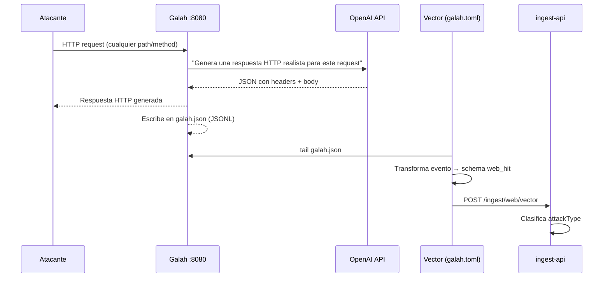

import { Aside } from '@astrojs/starlight/components';

[Galah](https://github.com/0x4D31/galah) es un honeypot HTTP de alta interaccion que usa un Large Language Model (OpenAI o compatible) para generar respuestas HTTP plausibles en tiempo real. En lugar de tener respuestas hardcodeadas, Galah analiza cada request y genera una respuesta que imita el comportamiento del servicio atacado.

## Por que Galah complementa al web-honeypot

| Aspecto | web-honeypot (Flask) | Galah |
|---------|---------------------|-------|
| Respuestas | Estaticas, catálogo predefinido | Generadas por LLM en tiempo real |
| Cobertura | ~30 tipos de paths conocidos | Cualquier path / payload imaginable |
| Latencia | Muy baja | Mayor (round-trip al LLM) |
| Costo | Gratis | Depende del proveedor LLM |
| Deteccion IA | Solo logs basicos | Captura headers + body completo |

<Aside type="tip">
Usa ambos: el web-honeypot para bajo costo y alta velocidad, y Galah en un puerto alternativo (o en un host dedicado) para capturar ataques mas sofisticados que requieren respuestas dinamicas.
</Aside>

---

## Flujo de datos



---

## Configuracion (`sensors/galah/config/config.yaml`)

```yaml
system_prompt: |
  Your task is to analyze the headers and body of an HTTP request and generate a
  realistic and engaging HTTP response emulating the behavior of the targeted application.
  ...

ports:
  - port: 8080
    protocol: HTTP
```

El `system_prompt` instruye al LLM a:
- Emular el servicio que el atacante intenta explotar
- Generar respuestas que parecen vulnerables si el path lo sugiere
- Incluir los headers correctos (`Content-Type`, codificacion, etc.)
- No exponer que es un honeypot

---

## Vector shipper para Galah (`vector/galah.toml`)

Galah escribe eventos en `galah.json` (JSONL). El archivo `vector/galah.toml` hace tres cosas:

1. **Tail** — lee `galah.json` con offset persistente en disco
2. **Transform** — extrae campos del evento Galah y los mapea al schema `web_hit`:
   - `srcIP` → `srcIp` (removiendo el prefijo `::ffff:`)
   - `httpRequest.request` → `path` + `query`
   - `httpRequest.userAgent` → `userAgent`
   - Clasifica `attackType` por regex (sqli, xss, lfi, cmdi, info_disclosure, scanner, recon)
   - Agrega headers de meta-datos Galah (`x-galah-result`, `x-galah-error-type`)
3. **Sink HTTP** — `POST /ingest/web/vector` con batch 50 eventos / 2s, buffer en disco 256 MB, retry 360 intentos

La clasificacion de tipo de ataque en el shipper es independiente de la del web-honeypot — usa los mismos patrones regex para mantener consistencia en el dashboard.

---

## Configuracion en Docker Compose

```yaml
# docker-compose.yml (dev)
galah:
  build:
    context: ./galah
  container_name: galah
  restart: unless-stopped
  volumes:
    - ./galah/config:/galah/config:ro
    - galah_logs:/galah/logs
  ports:
    - "8080:8080"
  environment:
    OPENAI_API_KEY: ${OPENAI_API_KEY}

galah-beacon:
  image: python:3.12-alpine
  container_name: galah-beacon
  environment:
    SENSOR_ID: galah-local-01
    SENSOR_NAME: "Galah HTTP Honeypot (AI)"
    SENSOR_PROTOCOL: http
    SENSOR_PORTS: "8080"
    INGEST_API_URL: ${INGEST_API_URL}
    INGEST_SHARED_SECRET: ${INGEST_SHARED_SECRET}
  volumes:
    - sensors/cowrie/heartbeat.py:/heartbeat.py:ro
  command: ["python3", "/heartbeat.py"]

vector-galah:
  image: timberio/vector:0.40.0-alpine
  volumes:
    - galah_logs:/galah/logs:ro
    - ./vector/galah.toml:/etc/vector/vector.toml:ro
    - galah_vector_data:/var/lib/vector
  environment:
    GALAH_LOG_PATH: /galah/logs/galah.json
    INGEST_API_URL: http://ingest-api:3000
    INGEST_SHARED_SECRET: ${INGEST_SHARED_SECRET}
```

---

## Imagen Docker

La imagen se construye desde source:

```dockerfile
FROM golang:1.23-alpine AS builder
RUN git clone --depth 1 https://github.com/0x4D31/galah.git .
RUN go build -o /galah ./cmd/galah

FROM alpine:3.20
COPY --from=builder /galah .
COPY entrypoint.sh .
VOLUME ["/galah/config", "/galah/logs"]
EXPOSE 8080
ENTRYPOINT ["./entrypoint.sh"]
```

---

## Probar Galah localmente

```bash
# Levantar Galah y su Vector shipper
docker compose up galah vector-galah galah-beacon -d

# Ver logs de Galah en tiempo real
docker logs -f galah

# Generar trafico de prueba
curl http://localhost:8080/wp-login.php
curl "http://localhost:8080/api/v1/users?id=1' OR 1=1--"
curl http://localhost:8080/.env
curl -X POST http://localhost:8080/upload -d "file=../../etc/passwd"
```

Los eventos aparecen en el dashboard bajo `/web-attacks` con `attackType` clasificado automaticamente.

---

## Variables de entorno

| Variable | Descripcion |
|----------|-------------|
| `OPENAI_API_KEY` | API key de OpenAI (o proveedor compatible) |
| `GALAH_LOG_PATH` | Ruta al `galah.json` en el contenedor Vector (default: `/galah/logs/galah.json`) |
| `INGEST_API_URL` | URL del ingest-api |
| `INGEST_SHARED_SECRET` | Token para `X-Ingest-Token` |
