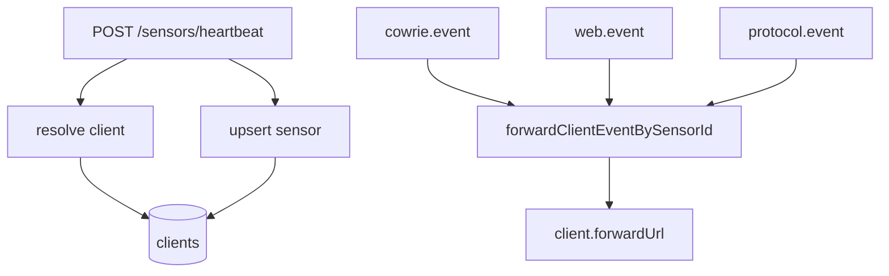

La ingest-api es el nucleo de procesamiento de la plataforma. Es una API Fastify + TypeScript que recibe eventos de Cowrie, web-honeypot y protocolos auxiliares, los normaliza, calcula el risk score por IP, los persiste en PostgreSQL via Prisma y resuelve el routing por cliente.

## Responsabilidades

1. **Recibir** eventos SSH, HTTP y de protocolos como FTP, MySQL, SMB o port scans.
2. **Validar** autorizacion via `X-Ingest-Token` si `INGEST_SHARED_SECRET` esta definido.
3. **Normalizar** el formato de los eventos de Cowrie a la estructura interna.
4. **Persistir** sesiones, eventos, web hits y protocol hits en PostgreSQL.
5. **Asignar** sensores a clientes a partir de heartbeats y actualizaciones manuales.
6. **Forwardear** eventos nuevos a la URL del cliente cuando aplica.
7. **Calcular** risk scores y servir los datos al dashboard.

## Estructura

```text
apps/ingest-api/src/
|- main.ts                     # Arranque de Fastify
|- routes/
|  |- health.ts               # GET /health
|  |- ingest/                 # POST /ingest/cowrie/*
|  |- sessions.ts             # GET /sessions, /sessions/:id
|  |- events.ts               # GET /events
|  |- web.ts                  # POST /ingest/web/* y GET /web-hits/*
|  |- protocol.ts             # POST /ingest/protocol/event
|  |- sensors.ts              # Heartbeats, inventario y asignacion
|  |- clients.ts              # CRUD basico de clientes
|  |- threats.ts              # GET /threats, /threats/:ip
|  `- stats.ts                # GET /stats/*
|- lib/
|  |- normalizer.ts
|  |- parser.ts
|  |- risk-score.ts
|  `- client-forward.ts       # Forwarding por cliente
`- prisma/
   |- schema.prisma
   |- seed.ts
   `- migrations/
```

## Schema de base de datos

Las entidades principales son:

- **Session**: una conexion SSH completa, con IP, duracion, login exitoso o no y cliente SSH.
- **Event**: un evento individual dentro de una sesion, como comando, login attempt o file download.
- **WebHit**: un request HTTP capturado por el web honeypot.
- **ProtocolHit**: un evento de protocolos como FTP, MySQL, SMB, RPC o TFTP.
- **Sensor**: registro operativo del honeypot real que envia heartbeats y eventos.
- **Client**: tenant logico al que pertenecen uno o varios sensores.

## Routing por cliente



La relacion cliente-sensor se usa en dos lugares:

- separar inventario y detalle en el dashboard
- reenviar cada evento nuevo a la `forwardUrl` del cliente

El forwarding actual es asincrono y best-effort: si el endpoint remoto falla, el evento no se pierde localmente y la API sigue respondiendo normal.

## Autorizacion

Si la variable `INGEST_SHARED_SECRET` esta definida, todos los endpoints `POST /ingest/*`, `POST /sensors/*`, `PUT /sensors/:sensorId/client`, `POST /clients` y `PATCH /clients/:clientId` exigen el header:

```text
X-Ingest-Token: <valor-del-secret>
```

Las peticiones sin ese header o con token incorrecto reciben `401 Unauthorized`.

Los endpoints `GET` no requieren autenticacion a nivel de API, porque la expectativa es que `ingest-api` no sea accesible desde internet en produccion.

## Risk score engine

`lib/risk-score.ts` calcula un score de 0 a 100 por IP combinando:

| Factor | Peso |
|--------|------|
| Login SSH exitoso | Alto |
| Comandos de tipo `malware_drop` o `persistence` | Muy alto |
| Ataques web graves como CMDI o SQLi | Alto |
| Correlacion cross-protocol, misma IP en SSH y HTTP | Bonus |
| Multiples vectores de ataque | Acumulativo |

## Healthcheck

```bash
curl http://localhost:3000/health
# {"status":"ok","timestamp":"...","lastEvent":"..."}
```

El healthcheck es el criterio que Docker Compose usa para marcar el servicio como `healthy` antes de arrancar servicios dependientes.

## Comandos de desarrollo

```bash
cd apps/ingest-api

npm run dev
npm run build
npm run db:push
npm run db:migrate
npx prisma studio
npx prisma db seed
npm test
```
