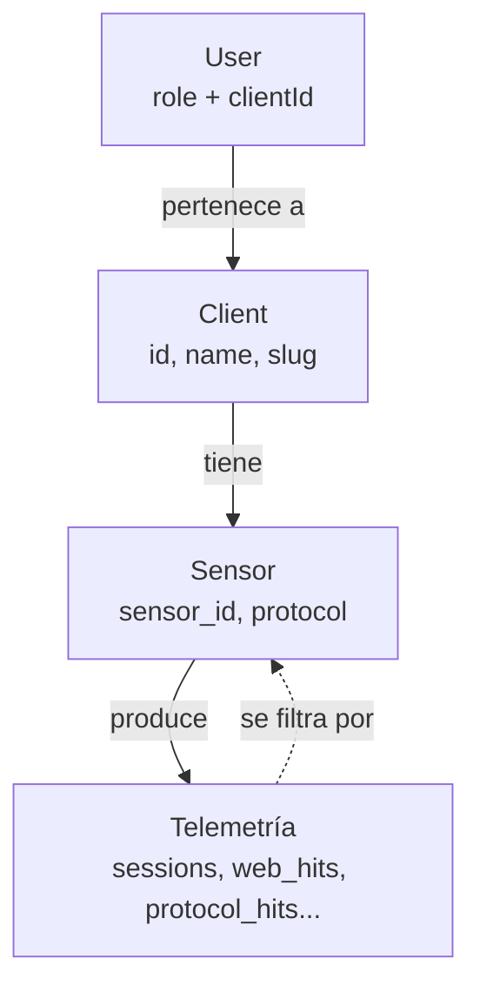
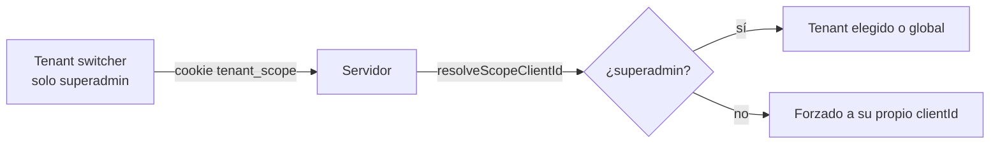

import { Aside } from '@astrojs/starlight/components';

La plataforma es **multi-tenant**: cada cliente (empresa) tiene sus propios sensores y solo ve sus propios datos. Un usuario normal está atado a un cliente; un `superadmin` puede ver todo de golpe o "entrar" a un tenant concreto.

<Aside type="caution">
Esta feature se está construyendo por fases. Las alertas y el dashboard home ya están aislados; otras vistas (sessions, threats, web-attacks, etc.) aceptan el scope pero aún no lo aplican de forma completa. El estado detallado vive en `docs/plans/MULTI_TENANT_ROADMAP.md`.
</Aside>

---

## Modelo

- **Client** — un tenant: `id`, `name`, `slug`, `description`, `forwardUrl` opcional.
- **Sensor** — pertenece a un cliente vía `client_id`. Su `protocol` puede ser `ssh`, `http`, `ftp`, `mysql`, `port` o `deception`.
- **Telemetría** — todas las tablas de eventos llevan `sensor_id`, así el aislamiento se aplica filtrando por los sensores del cliente.
- **User** — tiene `role` y un `clientId` (en Better Auth). `clientId` nulo + rol no-superadmin = no ve nada (fail-closed).

---

## Roles

Jerarquía de permisos (de menor a mayor), en `apps/dashboard/lib/roles-shared.ts`:

| Rol | Acceso |
|-----|--------|
| `viewer` | Solo lectura del dashboard |
| `analyst` | Gestión de infraestructura y análisis de datos |
| `admin` | Acceso total incluyendo usuarios y configuración |
| `superadmin` | Acceso global a todos los clientes (multi-tenant) |

El acceso global es **solo por rol explícito** (`superadmin`), nunca por tener `clientId` nulo.

---

## Selector de tenant

El sidebar muestra un **selector de tenant** únicamente al `superadmin`: puede elegir "Global" (todos los clientes) o un cliente concreto. La elección se guarda en la cookie `tenant_scope` y refresca las vistas.

---

## Regla de oro

<Aside type="danger">
El `clientId` efectivo **siempre se deriva del usuario en el servidor, nunca del query param ni de la cookie en bruto.** La cookie `tenant_scope` jamás amplía el acceso: un usuario que no es superadmin queda atado a su `clientId` aunque manipule la cookie.
</Aside>

Piezas clave:

- `resolveScopeClientId(user, requested)` (`roles-shared.ts`, puro y testeado): superadmin → tenant elegido o global; usuario con scope → forzado a su `clientId`; no-superadmin sin `clientId` → `SCOPE_NONE` (no ve nada).
- `effectiveScope()` / `effectiveSensorScope()` (`apps/dashboard/lib/tenant-scope.ts`): lee la cookie, resuelve el cliente y obtiene sus `sensorIds`. Cacheado por request.
- `parseSensorScope(query)` (`apps/ingest-api/src/lib/sensor-scope.ts`): traduce `?sensorIds=a,b` a una condición SQL (`AND sensor_id IN (...)`, `AND false` o sin filtro) y aporta un sufijo para la cache key de cada endpoint.

---

## Estado por vista

| Área | Estado |
|------|--------|
| Alertas | ✅ aisladas (columna `client_id`) |
| Dashboard home | ✅ scopeado por sensores del tenant |
| Sessions, threats, web-attacks, services, credentials, malware, iocs | 🚧 aceptan scope, falta aplicarlo en backend |
| Gestión de `/users` y `/sensors` por tenant | 🚧 pendiente |

---

## Relacionados

- [Clientes y enrutado de sensores](/services/clients/) — crear clientes y asignar sensores.
- [Gestión de usuarios](/services/user-management/) — asignar rol y tenant a cada usuario.
- [Alertas de Discord](/services/discord-alerts/) — aislamiento de alertas por cliente.
