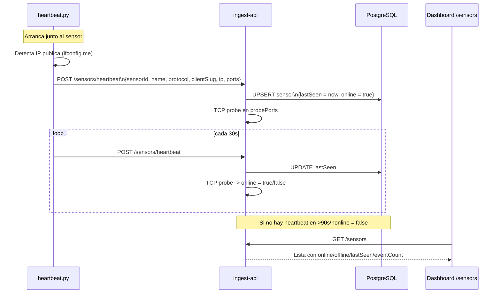
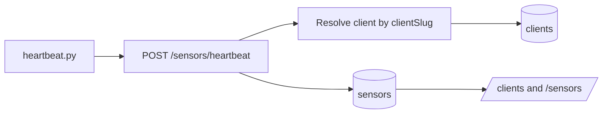
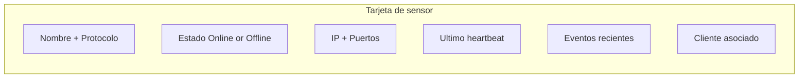

import { Aside } from '@astrojs/starlight/components';

El sistema de sensor health monitoring permite que el dashboard sepa exactamente que sensores estan activos, cuando fue el ultimo heartbeat, a que cliente pertenecen y si sus puertos estan accesibles, todo sin depender de logs del honeypot.

---

## Conceptos clave

- **Sensor**: cualquier proceso que captura trafico, como Cowrie, web-honeypot, Dionaea, FTP o MySQL.
- **Beacon**: sidecar Python (`heartbeat.py`) que corre junto al sensor y envia heartbeats periodicos.
- **Heartbeat**: peticion `POST /sensors/heartbeat` enviada cada 30 segundos con metadata del sensor.
- **Probe**: el ingest-api hace TCP probe en los puertos declarados para confirmar online/offline independientemente del beacon.
- **Client routing**: opcionalmente el heartbeat incluye `clientSlug` y `clientName` para asociar el sensor a un cliente.

---

## Flujo completo



### Auto-asignacion de cliente



---

## `heartbeat.py` - beacon generico

El script `sensors/cowrie/heartbeat.py` es un sidecar reutilizable por cualquier sensor. No tiene dependencias del honeypot especifico.

### Variables de entorno que consume

| Variable | Default | Descripcion |
|----------|---------|-------------|
| `INGEST_API_URL` | `http://ingest-api:3000` | URL del ingest-api |
| `INGEST_SHARED_SECRET` | - | Token de autorizacion |
| `SENSOR_ID` | `sensor-<hostname>` | ID unico del sensor |
| `SENSOR_NAME` | `SSH Honeypot (Cowrie)` | Nombre legible en el dashboard |
| `SENSOR_IP` | auto-detectada | IP publica del sensor. Si no se pone, heartbeat.py la detecta via `ifconfig.me` |
| `SENSOR_PROTOCOL` | `ssh` | Protocolo principal: `ssh`, `http`, `port-scan`, `dionaea`, etc. |
| `SENSOR_VERSION` | `cowrie` | Version del honeypot |
| `SENSOR_PORTS` | `22` | Puertos que escucha, separados por espacios |
| `SENSOR_PROBE_PORTS` | - | Puertos que el ingest-api sondea para verificar conectividad |
| `SENSOR_HOST` | - | Hostname Docker del contenedor del honeypot para TCP probe interno |
| `CLIENT_SLUG` | - | Slug del cliente al que pertenece el sensor. Ej: `cliente-a` |
| `CLIENT_NAME` | - | Nombre legible del cliente. Se usa al auto-crear el cliente si aun no existe |

### Variables para separacion por cliente

Si quieres que el sensor quede asociado automaticamente a un cliente desde el primer heartbeat:

```bash
CLIENT_SLUG=cliente-a
CLIENT_NAME=Cliente A
```

Con eso el dashboard lo mostrara agrupado bajo ese cliente y el ingest-api podra usar esa relacion para forwarding por cliente.

### Como montarlo en cualquier servicio

```yaml
mi-sensor-beacon:
  image: python:3.12-alpine
  restart: unless-stopped
  depends_on:
    - mi-sensor
  environment:
    SENSOR_ID: mi-sensor-prod-01
    SENSOR_NAME: "Mi Sensor - VPS Berlin"
    SENSOR_PROTOCOL: http
    CLIENT_SLUG: cliente-a
    CLIENT_NAME: "Cliente A"
    SENSOR_PORTS: "80 443"
    SENSOR_PROBE_PORTS: "80"
    SENSOR_HOST: mi-sensor
    INGEST_API_URL: ${INGEST_API_URL}
    INGEST_SHARED_SECRET: ${INGEST_SHARED_SECRET}
  volumes:
    - sensors/cowrie/heartbeat.py:/heartbeat.py:ro
  command: ["python3", "/heartbeat.py"]
```

---

## Dashboard `/sensors`

La pagina muestra una tarjeta por sensor registrado. Si el sensor ya pertenece a un cliente, el inventario mantiene esa separacion para que la vista operativa coincida con `/clients`.



### Protocolos soportados con icono

| Protocolo | Icono | Color |
|-----------|-------|-------|
| `ssh` | Server | Cyan |
| `http` | Globe | Verde |
| `ftp` | Server | Amarillo |
| `mysql` | Database | Purpura |
| `port-scan` | Network | Azul |
| `dionaea` | Network | Rojo |
| `smb` | Server | Naranja |
| `mssql` | Database | Rosa |
| `rpc` | Network | Indigo |
| `tftp` | Server | Lima |
| `mqtt` | Network | Teal |

---

## Endpoint `POST /sensors/heartbeat`

```http
POST /sensors/heartbeat
X-Ingest-Token: <INGEST_SHARED_SECRET>
Content-Type: application/json

{
  "sensorId": "cowrie-ssh-prod-01",
  "name": "SSH Honeypot (Cowrie) - VPS Berlin",
  "protocol": "ssh",
  "clientSlug": "cliente-a",
  "clientName": "Cliente A",
  "ip": "1.2.3.4",
  "version": "cowrie",
  "ports": [22],
  "probePorts": [22],
  "host": "cowrie"
}
```

**Respuesta:**

```json
{ "ok": true }
```

<Aside type="note">
`probePorts` son los puertos que el ingest-api intenta conectar via TCP para verificar que el sensor realmente esta escuchando. `host` es el hostname Docker, util cuando el probe se hace desde dentro de la red Docker y no desde internet.
</Aside>

Si `clientSlug` llega informado:

1. se busca el cliente por slug
2. si no existe, se crea
3. el sensor queda asociado a ese cliente

---

## Agregar un sensor nuevo

1. Escribe el sidecar en `docker-compose`:

```yaml
mi-sensor-beacon:
  image: python:3.12-alpine
  restart: unless-stopped
  environment:
    SENSOR_ID: mi-sensor-01
    SENSOR_NAME: "Mi Protocolo Honeypot"
    SENSOR_PROTOCOL: mqtt
    CLIENT_SLUG: cliente-a
    CLIENT_NAME: "Cliente A"
    SENSOR_PORTS: "1883"
    SENSOR_PROBE_PORTS: "1883"
    SENSOR_HOST: mi-sensor
    INGEST_API_URL: ${INGEST_API_URL}
    INGEST_SHARED_SECRET: ${INGEST_SHARED_SECRET}
  volumes:
    - sensors/cowrie/heartbeat.py:/heartbeat.py:ro
  command: ["python3", "/heartbeat.py"]
```

2. El sensor aparece automaticamente en `/sensors` del dashboard en el proximo heartbeat, maximo 30 segundos.

3. Si definiste `CLIENT_SLUG`, tambien aparecera dentro de `/clients/<slug>`.

4. No necesitas modificar el codigo del ingest-api ni del dashboard, el sistema es dinamico.

---

## Asignacion manual y desasignacion

Aunque el heartbeat ya puede auto-asignar clientes, tambien puedes mover sensores manualmente:

- desde `/clients` creas el cliente
- en `/clients/:slug` usas `Assign` para vincular sensores sin cliente
- en esa misma vista usas `Unassign` para devolverlos al pool libre

El endpoint que usa esa pantalla es:

```http
PUT /sensors/:sensorId/client
X-Ingest-Token: <INGEST_SHARED_SECRET>
Content-Type: application/json
```

Asignar:

```json
{
  "clientId": "cl_123"
}
```

Desasignar:

```json
{
  "clientId": null
}
```

---

## Troubleshooting

### El sensor aparece como Offline

- Verifica que `SENSOR_PROBE_PORTS` son los puertos correctos y accesibles desde el ingest-api.
- Si el sensor esta en un host diferente, asegurate de que hay conectividad entre el ingest-api y el host del sensor.
- Revisa los logs del beacon: `docker logs -f cowrie-beacon`.

### No aparece ningun sensor

- Verifica que `INGEST_SHARED_SECRET` coincide entre el beacon y el ingest-api.
- Comprueba que el ingest-api esta en la misma red Docker o accesible via `INGEST_API_URL`.
- Haz un test manual:

```bash
curl -X POST http://localhost:3000/sensors/heartbeat \
  -H "X-Ingest-Token: <secret>" \
  -H "Content-Type: application/json" \
  -d '{"sensorId":"test","name":"Test","protocol":"ssh","ports":[22]}'
```

### El sensor quedo en el cliente incorrecto

- Corrige `CLIENT_SLUG` y `CLIENT_NAME` en el stack del sensor.
- O reasignalo desde `/clients/:slug`.
- Tambien puedes usar `PUT /sensors/:sensorId/client` para moverlo manualmente.
