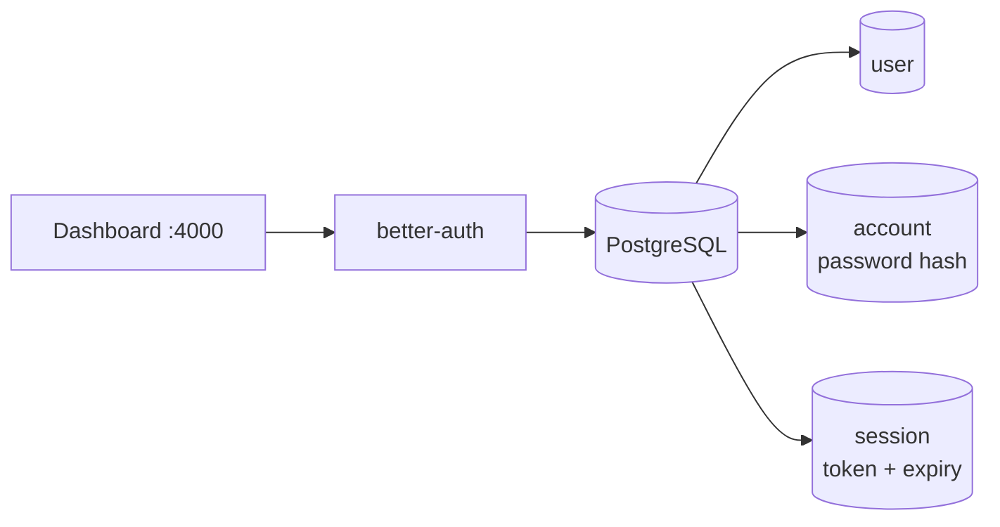
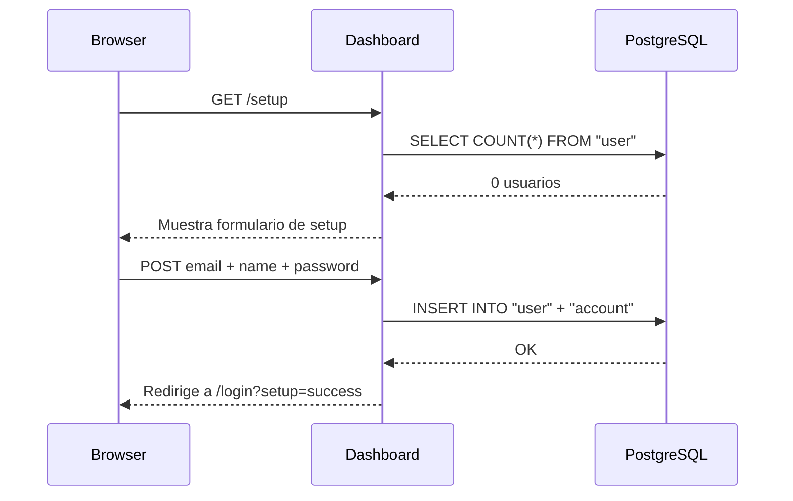

import { Aside } from '@astrojs/starlight/components';

El modulo de gestion de usuarios permite controlar quien tiene acceso al dashboard. Cada persona del equipo puede tener su propia cuenta con credenciales independientes. Todas las cuentas tienen el mismo nivel de acceso — no hay roles diferenciados por el momento.

---

## Donde se almacenan los usuarios

Los usuarios se almacenan en la tabla `user` de PostgreSQL, gestionada por [better-auth](https://www.better-auth.com/). La contrasena se hashea antes de guardarse (en la tabla `account`). Las sesiones activas se guardan en la tabla `session` con expiracion de 8 horas.



---

## Primer usuario

El primer usuario se crea a traves del wizard en `/setup`. Este proceso ocurre automaticamente la primera vez que el contenedor arranca y no hay ninguna cuenta registrada.



Una vez que existe al menos un usuario, `/setup` redirige directamente a `/login`.

---

## Crear usuarios adicionales

Los usuarios adicionales se crean desde `/users` en el dashboard. Solo un usuario autenticado puede crear mas cuentas — no hay registro publico.

### Desde el dashboard

1. Ir a **Administracion → Usuarios** en el sidebar.
2. Hacer clic en **Crear usuario**.
3. Completar nombre, email y contrasena (minimo 8 caracteres).
4. Confirmar — el usuario queda activo de inmediato.

### Via API (programatico)

```http
POST /api/users
Content-Type: application/json
Cookie: better-auth.session_token=<tu-sesion>

{
  "name": "Ana Lopez",
  "email": "ana@empresa.com",
  "password": "contraseña-segura"
}
```

**Respuesta exitosa (`201`):**

```json
{
  "id": "usr_abc123",
  "name": "Ana Lopez",
  "email": "ana@empresa.com"
}
```

**Errores posibles:**

| Codigo | Descripcion |
|--------|-------------|
| `400` | Faltan campos obligatorios o la contrasena tiene menos de 8 caracteres |
| `401` | No hay sesion activa |
| `409` | Ya existe un usuario con ese email |
| `500` | Error interno al crear la cuenta |

<Aside type="caution">
El endpoint usa `auth.api.signUpEmail()` internamente — esto garantiza que la contrasena se hashea correctamente y nunca se guarda en texto plano.
</Aside>

---

## Listar usuarios

```http
GET /api/users
Cookie: better-auth.session_token=<tu-sesion>
```

**Respuesta:**

```json
[
  {
    "id": "usr_abc123",
    "name": "Nicolas Moina",
    "email": "nicolas@empresa.com",
    "emailVerified": false,
    "createdAt": "2026-05-17T10:00:00.000Z",
    "updatedAt": "2026-05-17T10:00:00.000Z"
  },
  {
    "id": "usr_def456",
    "name": "Ana Lopez",
    "email": "ana@empresa.com",
    "emailVerified": false,
    "createdAt": "2026-05-17T11:30:00.000Z",
    "updatedAt": "2026-05-17T11:30:00.000Z"
  }
]
```

Los usuarios se ordenan por fecha de creacion (mas antiguo primero).

---

## Eliminar un usuario

Eliminar un usuario borra en cascada su `account` (contrasena) y todas sus `session` activas — el usuario queda desconectado inmediatamente.

<Aside type="caution">
No se puede eliminar la propia cuenta mientras se esta autenticado con ella. La interfaz oculta el boton de borrado para el usuario actual y el API devuelve `400` si lo intentas.
</Aside>

### Desde el dashboard

1. Ir a **Administracion → Usuarios**.
2. Hacer clic en el icono de papelera en la fila del usuario.
3. Confirmar el dialogo de advertencia.

### Via API

```http
DELETE /api/users/<id>
Cookie: better-auth.session_token=<tu-sesion>
```

**Respuesta exitosa:** `204 No Content`

**Errores posibles:**

| Codigo | Descripcion |
|--------|-------------|
| `400` | Intentando eliminar la propia cuenta |
| `401` | No hay sesion activa |
| `404` | Usuario no encontrado |

---

## Actualizar nombre de usuario

```http
PATCH /api/users/<id>
Content-Type: application/json
Cookie: better-auth.session_token=<tu-sesion>

{
  "name": "Nuevo Nombre"
}
```

**Respuesta exitosa (`200`):**

```json
{
  "id": "usr_def456",
  "name": "Nuevo Nombre",
  "email": "ana@empresa.com"
}
```

---

## Vista en el dashboard (`/users`)

La pagina `/users` muestra una tabla con todos los usuarios registrados:

| Columna | Descripcion |
|---------|-------------|
| **Nombre** | Nombre del usuario. El usuario actual tiene un badge "tu". |
| **Email** | Direccion de correo (fuente verdad del login). |
| **Registrado** | Tiempo relativo desde la creacion de la cuenta. |
| Accion | Boton de eliminar (oculto para el usuario actual). |

El boton **Crear usuario** en la esquina superior derecha abre un modal con el formulario de creacion. La contrasena tiene toggle de visibilidad.

---

## Sesiones y seguridad

| Parametro | Valor |
|-----------|-------|
| Duracion maxima de sesion | 8 horas |
| Re-emision de cookie en actividad | Cada 2 horas |
| Cache del token en cookie firmada | 5 minutos (evita hits a BD en cada request) |
| Logout | `POST /api/auth/sign-out` (disponible via `signOut()` del cliente) |

Al eliminar un usuario se eliminan todas sus sesiones en la base de datos. Si el usuario estaba activo, su cookie expira naturalmente o queda invalida en el siguiente request.

---

## Auditoria

Cada accion sobre usuarios queda registrada en el audit log:

| Accion | Evento registrado |
|--------|------------------|
| Crear usuario | `CREATE USER` con email y nombre |
| Eliminar usuario | `DELETE USER` con email y nombre |
| Actualizar usuario | `UPDATE USER` con nuevo nombre |

Ver [Audit Log](/services/audit-log) para mas detalle sobre el registro de eventos.
